## 0 前言说明
1. **项目作品：[https://blog.csdn.net/feiyangqingyun/article/details/97565652](https://blog.csdn.net/feiyangqingyun/article/details/97565652)**
2. **网店地址：https://shop244026315.taobao.com/**
3. **联系方式：QQ（517216493）微信（feiyangqingyun）推荐加微信。**
4. **版本支持：所有项目已经全部支持Qt4/5/6所有版本以及后续版本。**
5. 监控作品体验：[https://pan.baidu.com/s/1d7TH_GEYl5nOecuNlWJJ7g](https://pan.baidu.com/s/1d7TH_GEYl5nOecuNlWJJ7g) 提取码：01jf
6. 其他作品体验：[https://pan.baidu.com/s/1ZxG-oyUKe286LPMPxOrO2A](https://pan.baidu.com/s/1ZxG-oyUKe286LPMPxOrO2A) 提取码：o05q
7. 监控系统在线文档：[https://feiyangqingyun.gitee.io/QWidgetDemo/video_system/](https://feiyangqingyun.gitee.io/QWidgetDemo/video_system/)
8. 大屏系统在线文档：[https://feiyangqingyun.gitee.io/QWidgetDemo/bigscreen/](https://feiyangqingyun.gitee.io/QWidgetDemo/bigscreen/)
9. 物联网系统在线文档：[https://feiyangqingyun.gitee.io/QWidgetDemo/iotsystem/](https://feiyangqingyun.gitee.io/QWidgetDemo/iotsystem/)

## 1 自定义控件大全
### 1.1 控件介绍
1. 超过202个精美控件并持续不断迭代更新升级，种类超多，控件类型极其丰富。
2. 涵盖了各种仪表盘、进度条、进度球、指南针、曲线图、标尺、温度计、导航条、导航栏，flatui、高亮按钮、滑动选择器、农历、广告轮播、饼状图、环形图、时间轴、拓展控件、增强控件等。
3. 每个类都是独立的一个.h头文件和.cpp实现文件组成，零耦合，不依赖其他文件，方便单个控件独立出来以源码形式集成到项目中，方便直观。
4. 控件数量远超其他第三方控件库比如qwt集成的控件数量，使用方式也比其简单友好零耦合。
5. 支持任意Qt版本，亲测Qt4.6到Qt6.2的所有版本，全部纯Qt编写，QWidget+QPainter绘制。
6. 支持任意编译器，包括但不限于mingw、msvc、gcc、clang等编译器。
7. 支持任意操作系统，包括但不限于windows、linux、mac、android、uos、银河麒麟、各种国产linux、嵌入式linux、树莓派、香橙派、全志H3等。
8. 支持编译生成设计师插件，可直接集成到QtCreator的控件栏中，和自带的控件一样使用，大部分效果只要设置几个属性即可，极为方便。
9. 支持编译生成独立的非插件形式的动态库文件，体积小，比如嵌入式linux不支持designer只需要动态库的形式。
10. 每个控件都有一个单独的完整的使用demo，方便参考学习单个控件使用，非常适合初学者。
11. 提供一个所有控件使用的集成的example，方便快速查看所有控件的效果。
12. 支持直接源码集成到example的方式，方便编译到安卓，for web套件等。
13. 支持编译成wasm文件，直接网页运行，可以在谷歌、火狐、edge等浏览器运行，原生性能。
14. 每个控件的源代码都有详细中文注释，都按照统一设计规范编写，方便学习自定义控件的编写。
15. 每个控件都内置默认配色，demo对应的配色都非常精美。
16. 部分控件提供多种样式风格选择，多种指示器样式选择。
17. 所有控件自适应布局和窗体拉伸变化，自动缩放。
18. 配套额外的自定义控件属性设计器，类似组态设计器，纯中文属性名称，支持拖曳设计，所见即所得，支持导入导出xml格式。
19. 集成fontawesome图形字体+阿里巴巴iconfont收藏的几百个图形字体，享受图形字体带来的乐趣。
20. 所有控件最后生成一个dll动态库文件，可以直接集成到qtcreator中拖曳设计使用。
21. 控件源码全部分门别类存放，pri模块形式集成，提供控件对照表快速查找对应控件和说明。

### 1.2 效果图

## 2 输入法
### 2.1 输入法V2018
1. 未采用Qt系统层输入法框架，独创输入切换机制。
2. 纯QWidget编写，支持任何目标平台（亲测windows、linux、嵌入式linux等），支持任意Qt版本（亲测Qt4.6.0到Qt6.2.0），支持任意编译器（亲测mingw、gcc、msvc等），支持任意控件输入包括网页中的输入控件。
3. 调用极为方便，pri文件调用形式，只要改成文件包含即可，例如pro文件中写 include($$PWD/inputnew/inputnew.pri)。
4. 界面清晰简洁，UI美观友好，非常适合触摸设备。
5. 支持实体键盘输入+鼠标单击输入+触摸输入。
6. Qt程序嵌入的浏览器中的网页中的文本框等控件的输入。
7. 迷你模式，界面大小随意设置，采用布局自使用任何分辨率。
8. 纯数字键盘模式，自由控制弹出完整输入法面板和数字键盘面板，只需要对控件设置属性即可。例如ui->txt->setProperty("flag", "number");
9. 控制需要显示输入法和不需要显示输入法，当某些控件不需要弹出输入法，只需要对应不需要弹出输入法的控件设置属性noinput为真即可。例如ui->txt->setProperty("noinput", true);
10. 自适应屏幕大小，输入法弹出位置为控件底部时，当超过桌面右边或者底部时，自动调整位置。
11. 实现了长按超过500毫秒重复执行按下的键的功能。例如长按退格键，不断删除。
12. shift键切换输入法，esc键隐藏输入法，空格选中第一个汉字，回车选中输入的拼音。和搜狗输入法处理一致。
13. 英文、中文、数字字母、大小写、特殊字符自由切换。
14. 支持单拼双拼词组输入，网上大部分只支持单个汉字输入。智能分页算法，可任意翻页查看汉字词组。
15. 默认自带5种皮肤颜色，可随意切换，用户也可用QSS自定义皮肤。
16. 字库文件可大可小，提供迷你版字库大小仅120KB，方便存储空间紧张的硬件，完整版字库25MB。
17. 可选谷歌内核的输入法引擎，字库文件1MB，不依赖数据库，资源占用低效率极高。支持模糊拼音，比如nh=你好。
18. 可选windows专有版本，支持外部程序输入，比如输入到记事本、QQ聊天窗口等。
19. 整个输入法代码行数1000行左右，非常小，不会对程序增加大小造成负担。
20. 代码结构极为清晰，注释详细，非常容易阅读和理解，同时也可以自行修改拓展自定义的需求。

### 2.2 输入法V2019
1. 未采用Qt系统层输入法框架，独创输入切换机制。
2. 纯QWidget编写，支持任何目标平台（亲测windows、linux、嵌入式linux等），支持任意Qt版本（亲测Qt4.6.0到Qt6.2.0），支持任意编译器（亲测mingw、gcc、msvc等），支持任意控件输入包括网页中的输入控件。
3. 调用极为方便，pri文件调用形式，只要改成文件包含即可，例如pro文件中写 include($$PWD/input2019/input2019.pri)。
4. 界面清晰简洁，UI美观友好，高仿IOS输入法，非常适合触摸设备。
5. 顶部滑动选词+弹出汉字面板选词，支持滑动。
6. 具有记忆功能，之前选中过的词语首先显示，支持单个拼音多个汉字，自动调整优先级。
7. 具有造词功能，可以直接打开文件文件写入自定义词组，最高级别显示。
8. 支持数字小键盘，可选是弹出全键盘的数字面板还是小键盘。
9. 多版面字符页面，可以自行拓展各种字符展示，可用于多语言输入。
10. 支持Qt程序嵌入的浏览器中的网页中的文本框等控件的输入。
11. 界面大小随意设置，采用布局自使用任何分辨率。
12. 属性控制数字输入，例如需要文本框默认弹出的是数字则设置代码 ui->txt->setProperty("flag", "number");
13. 自由控制需要显示输入法和不需要显示输入法，当某些控件不需要弹出输入法，只需要对应不需要弹出输入法的控件设置属性noinput为真即可。例如ui->txt->setProperty("noinput", true);
14. 界面自适应屏幕大小，输入法弹出位置为控件底部时，当超过桌面右边或者底部时，自动调整位置。
15. 实现了长按超过500毫秒重复执行按下的键的功能。例如长按退格键，不断删除。
16. 英文、中文、数字字母、大小写、特殊字符自由切换。
17. 支持单拼、全拼、模糊拼音输入，智能分页算法，可任意翻页查看汉字词组。
18. 默认自带5种皮肤颜色，可随意切换，用户也可用QSS自定义皮肤。
19. 谷歌内核的输入法引擎，品质保证，字库文件1MB，不依赖数据库，资源占用低效率极高。支持模糊拼音，比如nh=你好。
20. 可选windows专有版本，支持外部程序输入，比如输入到记事本、QQ聊天窗口等。
21. 整个输入法代码行数1000行左右，非常小，不会对程序增加大小造成负担。
22. 代码结构极为清晰，注释详细，非常容易阅读和理解，同时也可以自行修改拓展自定义的需求。

### 2.3 效果图

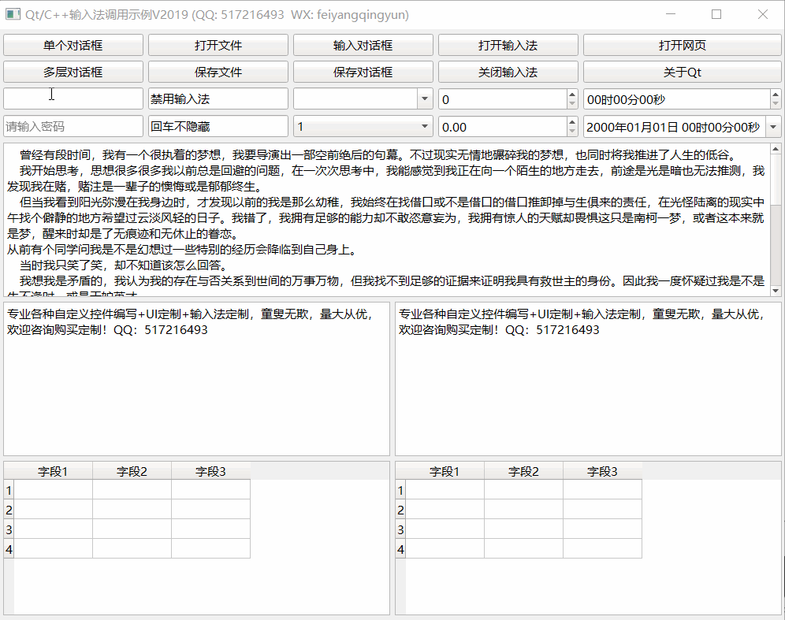

## 3 视频综合应用示例
### 3.1 基础功能
1. 支持各种音频视频文件格式，比如mp3、wav、mp4、asf、rm、rmvb、mkv等。
2. 支持本地摄像头设备，可指定分辨率、帧率。
3. 支持各种视频流格式，比如rtp、rtsp、rtmp、http等。
4. 本地音视频文件和网络音视频文件，自动识别文件长度、播放进度、音量大小、静音状态等。
5. 文件可以指定播放位置、调节音量大小、设置静音状态等。
6. 支持倍速播放文件，可选0.5倍、1.0倍、2.5倍、5.0倍等速度，相当于慢放和快放。
7. 支持开始播放、停止播放、暂停播放、继续播放。
8. 支持抓拍截图，可指定文件路径，可选抓拍完成是否自动显示预览。
8. 支持录像存储，手动开始录像、停止录像，部分内核支持暂停录像后继续录像，跳过不需要录像的部分。
9. 支持无感知切换循环播放、自动重连等机制。
10. 提供播放成功、播放完成、收到解码图片、收到抓拍图片、视频尺寸变化、录像状态变化等信号。
11. 多线程处理，一个解码一个线程，不卡主界面。

### 3.2 特色功能
1. 同时支持多种解码内核，包括qmedia内核（Qt4/Qt5/Qt6）、ffmpeg内核（ffmpeg2/ffmpeg3/ffmpeg4/ffmpeg5）、vlc内核（vlc2/vlc3）、mpv内核（mpv1/mp2）、监控厂家sdk内核等。
2. 非常完善的多重基类设计，新增一种解码内核只需要实现极少的代码量，就可以应用整套机制。
3. 同时支持多种画面显示策略，自动调整（原始分辨率小于显示控件尺寸则按照原始分辨率大小显示，否则等比例缩放）、等比例缩放（永远等比例缩放）、拉伸填充（永远拉伸填充）。所有内核和所有视频显示模式下都支持三种画面显示策略。
4. 同时支持多种视频显示模式，句柄模式（传入控件句柄交给对方绘制控制）、绘制模式（回调拿到数据后转成QImage用QPainter绘制）、GPU模式（回调拿到数据后转成yuv用QOpenglWidget绘制）。
5. 支持多种硬件加速类型，ffmpeg可选dxva2、d3d11va等，mpv可选auto、dxva2、d3d11va，vlc可选any、dxva2、d3d11va。不同的系统环境有不同的类型选择，比如linux系统有vaapi、vdpau，macos系统有videotoolbox。
6. 解码线程和显示窗体分离，可指定任意解码内核挂载到任意显示窗体，动态切换。
7. 支持共享解码线程，默认开启并且自动处理，当识别到相同的视频地址，共享一个解码线程，在网络视频环境中可以大大节约网络流量以及对方设备的推流压力。国内顶尖视频厂商均采用此策略。这样只要拉一路视频流就可以共享到几十个几百个通道展示。
8. 自动识别视频旋转角度并绘制，比如手机上拍摄的视频一般是旋转了90度的，播放的时候要自动旋转处理，不然默认是倒着的。
9. 自动识别视频流播放过程中分辨率的变化，在视频控件上自动调整尺寸。比如摄像机可以在使用过程中动态配置分辨率，当分辨率改动后对应视频控件也要做出同步反应。
10. 音视频文件无感知自动切换循环播放，不会出现切换期间黑屏等肉眼可见的切换痕迹。
11. 视频控件同时支持任意解码内核、任意画面显示策略、任意视频显示模式。
12. 视频控件悬浮条同时支持句柄、绘制、GPU三种模式，非绝对坐标移来移去。
13. 本地摄像头设备支持指定设备名称、分辨率、帧率进行播放。
14. 录像文件同时支持打开的视频文件、本地摄像头、网络视频流等。
15. 瞬间响应打开和关闭，无论是打开不存在的视频或者网络流，探测设备是否存在，读取中的超时等待，收到关闭指令立即中断之前的操作并响应。
16. 支持打开各种图片文件，支持本地音视频文件拖曳播放。
17. 视频控件悬浮条自带开始和停止录像切换、声音静音切换、抓拍截图、关闭视频等功能。
18. 音频组件支持声音波形值数据解析，可以根据该值绘制波形曲线和柱状声音条，默认提供了声音振幅信号。
19. 代码框架和结构优化到最优，性能强大，持续迭代更新升级。
20. 源码支持Qt4、Qt5、Qt6，兼容所有版本。

### 3.3 视频控件
1. 可动态添加任意多个osd标签信息，标签信息包括名字、是否可见、字号大小、文本文字、文本颜色、标签图片、标签坐标、标签格式（文本、日期、时间、日期时间、图片）、标签位置（左上角、左下角、右上角、右下角、居中、自定义坐标）。
2. 可动态添加任意多个图形信息，这个非常有用，比如人工智能算法解析后的图形区域信息直接发给视频控件即可。图形信息支持任意形状，直接绘制在原始图片上，采用绝对坐标。
3. 图形信息包括名字、边框大小、边框颜色、背景颜色、矩形区域、路径集合、点坐标集合等。
4. 每个图形信息都可指定三种区域中的一种或者多种，指定了的都会绘制。
5. 内置悬浮条控件，悬浮条位置支持顶部、底部、左侧、右侧。
6. 悬浮条控件参数包括边距、间距、背景透明度、背景颜色、文本颜色、按下颜色、位置、按钮图标代码集合、按钮名称标识集合、按钮提示信息集合。
7. 悬浮条控件一排工具按钮可自定义，通过结构体参数设置，图标可选图形字体还是自定义图片。
8. 悬浮条按钮内部实现了录像切换、抓拍截图、静音切换、关闭视频等功能，也可以自行在源码中增加自己对应的功能。
9. 悬浮条按钮对应实现了功能的按钮，有对应图标切换处理，比如录像按钮按下后会切换到正在录像中的图标，声音按钮切换后变成静音图标，再次切换还原。
10. 悬浮条按钮单击后都用名称唯一标识作为信号发出，可以自行关联响应处理。
11. 悬浮条空白区域可以显示提示信息，默认显示当前视频分辨率大小，可以增加帧率、码流大小等信息。
12. 视频控件参数包括边框大小、边框颜色、焦点颜色、背景颜色（默认透明）、文字颜色（默认全局文字颜色）、填充颜色（视频外的空白处填充黑色）、背景文字、背景图片（如果设置了图片优先取图片）、是否拷贝图片、缩放显示模式（自动调整、等比例缩放、拉伸填充）、视频显示模式（句柄、绘制、GPU）、启用悬浮条、悬浮条尺寸（横向为高度、纵向为宽度）、悬浮条位置（顶部、底部、左侧、右侧）。

### 3.4 内核qmedia
1. 支持各种音视频文件、各种视频流网络流。
2. 支持开始播放、暂停播放、继续播放、停止播放、设置播放进度、倍速播放。
3. 可设置音量、静音切换、抓拍图片。
4. 自动提取专辑信息比如标题、艺术家、专辑、专辑封面，自动显示专辑封面。
5. 事件机制响应文件长度变化、播放进度变化、音量大小变化、静音状态变化、分辨率变化等。
6. 句柄模式显示悬浮条和osd标签控件，非绝对坐标move来move去这种垃圾方式。
7. 同时支持句柄和绘制两种模式，可拿到每一帧的图片数据，Qt4/Qt5采用QAbstractVideoSurface，Qt6采用QVideoSink。
8. 全宇宙唯一同时支持Qt4、Qt5、Qt6版本的播放器类，对应类qmediathread4.h、qmediathread5.h、qmediathread6.h。

### 3.5 内核ffmpeg
1. 支持各种音视频文件、本地摄像头设备，各种视频流网络流。
2. 支持开始播放、暂停播放、继续播放、停止播放、设置播放进度、倍速播放。
3. 可设置音量、静音切换、抓拍图片、录像存储。
4. 自动提取专辑信息比如标题、艺术家、专辑、专辑封面，自动显示专辑封面。
5. 完美支持音视频同步和倍速播放。
6. 解码策略支持速度优先、质量优先、均衡处理、最快速度。
7. 支持手机视频旋转角度显示，比如一般手机拍摄的视频是旋转了90度的，解码显示的时候需要重新旋转90度才是正的。
8. 自动转换yuv420格式，比如本地摄像头是yuyv422格式，有些视频文件是xx格式，统一将非yuv420格式转换，然后再进行处理。
9. 支持硬解码dxva2、d3d11va等，性能极高尤其是大分辨率比如4K视频。
10. 视频响应极低延迟0.2s左右，极速响应打开视频流0.5s左右，专门做了优化处理。
11. 硬解码和GPU绘制组合，极低CPU占用，比海康大华等客户端更优。
12. 支持视频流中的各种音频格式，AAC、PCM、G.726、G.711A、G.711Mu、G.711ulaw、G.711alaw、MP2L2等都支持，推荐选择AAC兼容性跨平台性最好。
13. 视频存储支持yuv、h264、mp4多种格式，音频存储支持pcm、wav、aac多种格式。默认视频mp4格式、音频aac格式。
14. 支持分开存储音频视频文件，也支持合并到一个mp4文件，默认策略是无论何种音视频文件格式存储，最终都转成mp4及aac格式，然后合并成音视频一起的mp4文件。
15. 支持本地摄像头实时视频显示带音频输入输出，音视频录制合并到一个mp4文件。
16. 支持H265编码（现在越来越多的监控摄像头是H265视频流格式）生成视频文件，内部自动识别切换编码格式。
17. 自动识别视频流动态分辨率改动，重新打开视频流。
18. 纯qt+ffmpeg解码，非sdl等第三方绘制播放依赖，gpu绘制采用qopenglwidget，音频播放采用qaudiooutput。
19. 同时支持ffmpeg2、ffmpeg3、ffmpeg4、ffmpeg5版本，全部做了兼容处理。如果需要支持xp需要选用ffmpeg3及以下。

### 3.6 内核vlc
1. 支持各种音视频文件、本地摄像头设备，各种视频流网络流。
2. 支持开始播放、暂停播放、继续播放、停止播放、设置播放进度、倍速播放。
3. 可设置音量、静音切换、抓拍图片、录像存储。
4. 自动提取专辑信息比如标题、艺术家、专辑、专辑封面，自动显示专辑封面。
5. 事件回调机制响应文件长度变化、播放进度变化、音量大小变化、静音状态变化、分辨率变化等。
6. 不用重新编译源码，实现句柄模式下响应鼠标键盘信息。
7. 不用重新编译源码，实现录像文件存储。手动开启录像和停止录像，录像文件名称自动调整为设置的名称。
8. 句柄模式显示悬浮条和osd标签控件，非绝对坐标move来move去这种垃圾方式。
9. 支持硬解码any、dxva2、d3d11va等，性能极高尤其是大分辨率比如4K视频。
10. 同时支持vlc2、vlc3版本，全部做了兼容处理。

### 3.7 内核mpv
1. 支持各种音视频文件、各种视频流网络流。
2. 支持开始播放、暂停播放、继续播放、停止播放、设置播放进度、倍速播放。
3. 可设置音量、静音切换、抓拍图片、录像存储。
4. 事件回调机制响应文件长度变化、播放进度变化、音量大小变化、静音状态变化、分辨率变化等。
5. 可自由设置分辨率宽高比，包括运行过程中设置。
6. 通用获取属性和设置属性函数，帮助文档找到对应属性列表，全部可以动态执行获取和设置。
7. 支持硬解码auto、dxva2、d3d11va等，性能极高尤其是大分辨率比如4K视频。
8. 同时支持mpv1、mpv2版本，全部做了兼容处理。

### 3.8 内核海康sdk
1. 支持海康设备视频流、MP4录像文件、本地MP4视频文件播放。
2. 支持windows、linux系统，支持32位、64位的库。
3. 支持句柄、绘制（回调拿到数据转QImage绘制）、GPU（回调拿到数据转yuv用QOpenGLWidget绘制）三种视频显示模式。
4. 本地文件支持开始播放、暂停播放、继续播放、停止播放、设置播放进度、倍速播放。
5. 可设置音量、静音切换、抓拍图片、录像存储。
6. 回调除了拿到图片数据还支持拿到音频数据并播放。
7. 可以获取每一帧的世界时间，比如 2022-09-08 11:11:11 000 表示该帧在 2022-09-08 11:11:11 000 存储的，可以很方便用于回放录像标记。

### 3.9 内核easyplayer
1. 支持各种音视频文件、各种视频流网络流包括监控设备视频流。
2. 支持本地摄像头设备播放。
3. 支持开始播放、暂停播放、继续播放、停止播放、设置播放进度、倍速播放。
4. 可设置音量、静音切换、抓拍图片、录像存储。
5. 可以开启音频可视化显示，可选波形和频谱两种方式。
6. 变速播放声音自动去噪，听起来柔和平滑。
7. 支持h264/h265编码生成视频文件，根据源头自动识别处理。

### 3.10 效果图

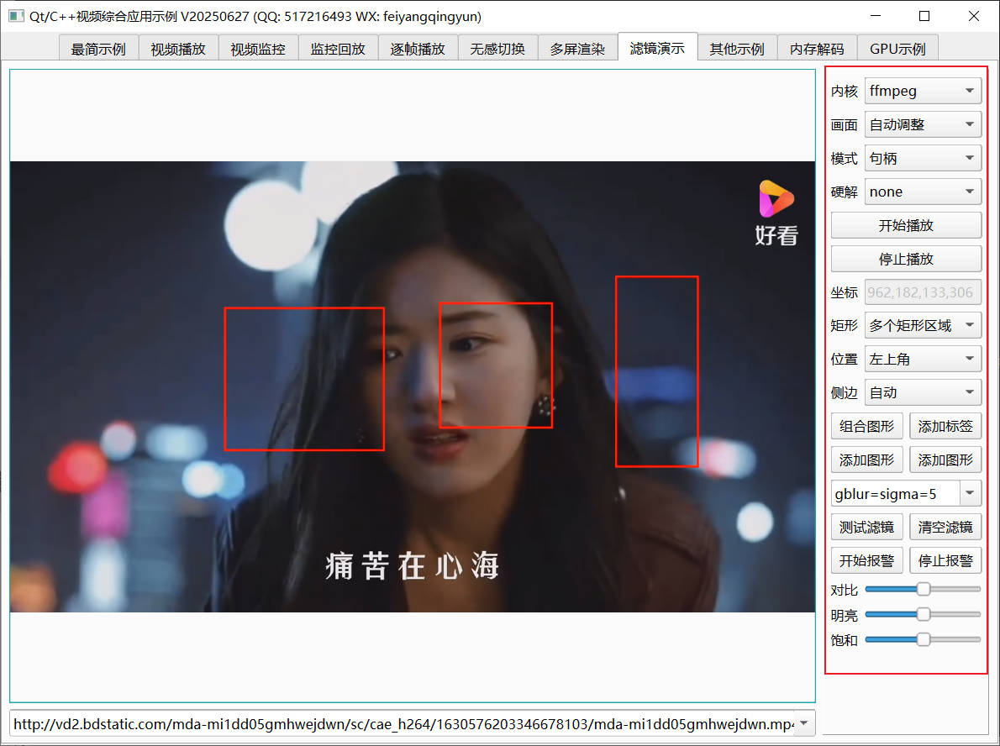

## 4 皮肤生成器+UIDemo
### 4.1 功能特点
1. 自带17套精美皮肤样式，其中包括黑色、灰色、扁平等。
2. 皮肤生成器只需要简单几步就可以生成一套自定义的皮肤。
3. 自带了26种uidemo，非常漂亮美观，涵盖了主界面布局、菜单切换等各种效果，总有一款适合你。
4. 所有代码和demo注释都非常详细整齐整洁，非常适合初学者学习。
5. uidemo由简入难，可以一步步学习下去，从入门到熟悉。
6. uidemo从常规的客户端到app端到触摸端等都有，既有鼠标操作的也有触摸操作的。
7. 皮肤中的qss样式表内容，覆盖了几乎所有的控件，非常适合学习每个控件的qss样式如何设置，而且分门别类非常清晰。
8. 自带的quiwidget类，集大成之所长，超级牛逼，内置了无边框的消息框、错误框、询问框、右下角信息框、输入框、日期范围选择框等，支持倒计时关闭，集成图形字体设置方法及根据指定文字获取图片，集成CRC校验、获取应用程序文件名、文件路径、设置窗体居中显示、设置翻译文件、设置编码、设置延时、设置系统时间等各种静态方法，保你满意。
9. 支持任意Qt版本+任意编译器+任意系统，可运行在win、linux、mac OS、嵌入式linux等各种系统上。

### 4.2 使用方法
1. 单击另存为按钮，可以将当前看到的界面的样式导出到一个样式表文件，包含自动生成的图片资源。
2. 右上角风格下拉菜单，可以切换17套皮肤，切换完成以后会自动应用。
3. 支持直接在右侧样式表编辑栏内直接修改样式表内容，修改完成立即应用。
4. 从左侧选择字体颜色+面板背景+渐变颜色等，只要选择8种颜色，就可以生成一套自己的皮肤。
5. 皮肤生成器只是用来生成统一风格的样式表，比如按钮+文本框+菜单等控件的风格，而不是生成ui界面文件。
6. 对应的uidemo是样式表+ui布局的整体综合应用，可以自行修改成自己想要的布局。
7. QChar图形字体的对照表在 图形字体对照表.png。

### 4.3 效果图

## 5 视频监控Onvif综合示例
### 5.1 功能特点
1. 广播搜索设备，支持IPC和NVR，依次返回。
2. 可选择不同的网卡IP进行对应网段设备的搜索。
3. 依次获取Onvif地址、Media地址、Profile文件、Rtsp地址。
4. 可对指定的Profile获取视频流Rtsp地址，比如主码流地址、子码流地址。
5. 可对每个设备设置Onvif用户信息，用于认证获取详细信息。
6. 可实时预览摄像机图像。
7. 支持云台控制，可上下左右调节云台，支持绝对移动、相对移动、连续移动三种方式，可对图像拉近拉远。
8. 支持获取预置位集合、调用预置位、添加预置位、删除预置位等。
9. 支持图片参数设置，包括亮度、对比度、饱和度、锐度等。
10. 支持Qt4和Qt6任意Qt版本以及后续Qt版本，亲测Qt4.7.0到Qt6.2。
11. 支持任意编译器，亲测mingw、msvc、gcc、clang。
12. 支持任意操作系统，亲测xp、win7、win10、android、linux、嵌入式linux、树莓派全志H3等。
13. 支持任意Onvif摄像机和NVR，亲测海康、大华、宇视、天地伟业、华为、海思芯片内核等，可定制开发。
14. 支持对指定IP地址及onvif地址进行单播搜索，比如跨网段情况下非常有用。
15. 支持指定过滤条件过滤搜索设备。
16. 支持搜索间隔和搜索策略设置，保证所有设备搜索回来，在大量设备现场很有用（亲测上千个摄像机现场，搜索回来的设备数量比摄像机厂家自带搜索工具还要准确）。
17. 可对设备进行重启、网络参数获取等。
18. 支持各种事件订阅、Onvif抓图等操作。
19. 支持NTP校时和时间同步设置。
20. 内置了线程实时执行Onvif指令队列，排队最大速度的执行对应的指令，执行结果信号发出。
21. 采用的最底层的TCP+UDP通信机制，原创最底层协议解析，纯QtWidget编写。
22. 超级小巧轻量，总共约3000行代码，不依赖任何第三方的库和组件，跨平台。
23. 封装好了通用的数据发送和接收解析的函数，可以非常方便的自行拓展其他Onvif处理。
24. 工具上提供了收发数据文本框，显示收发的数据，方便查看和分析。
25. 支持所有Onvif设备，代码工整，接口友好，直接引入pri即可使用。

### 5.2 主要功能
1. 搜索设备，获取设备的信息比如厂家、型号等。
2. 获取设备的多个配置文件信息profile。
3. 获取对应配置文件的视频流地址rtsp，以及分辨率等参数。
4. 云台控制，上下左右移动，焦距放大缩小，相对和绝对移动。
5. 获取预置位信息，触发预置位。
6. 订阅事件，接收设备的各种消息尤其是报警事件比如IO口的报警。
7. 抓图，获取设备当前的图片。
8. 获取、创建、删除用户信息。
9. 获取和设备网络配置信息比如IP地址等。
10. 获取和设置NTP时间同步以及设置设备时间。
11. 获取和设置视频参数和图片参数（亮度、色彩、饱和度）。
12. 重启设备。

### 5.3 云台说明
1. x、y、z 范围都在0-1之间。
2. x为负数，表示左转，x为正数，表示右转。
3. y为负数，表示下转，y为正数，表示上转。
4. z为正数，表示拉近，z为负数，表示拉远。
5. 通过x和y的组合，来实现云台的控制。
6. 通过z的组合，来实现焦距控制。

### 5.4 处理流程
1. 绑定组播IP（239.255.255.250）和端口（3702），发送固定的xml格式的数据搜索设备。
2. 接收到的xml格式的数据解析，得到设备的Onvif地址。
3. 对Onvif地址发送对应的数据，收到数据取出对应的节点数据。
4. 请求Onvif地址获取Media地址和Ptz地址，Media地址用来获取详细的配置文件，Ptz地址用来云台控制。
5. ptz控制是对Ptz地址发送对应的数据即可。
6. 设置了用户认证的需要组织用户token信息一块发送，每次都需要作鉴权处理。
7. 接收到的数据不是标准的xml数据，带有前缀命名空间，解析的时候要注意。
8. 每个厂家设备返回的数据未必完全一致，基本上都不一致，需要进行模糊查找节点值。
9. 特意采用底层协议解析，因为soap太臃肿函数名称太另类，特意做的轻量级的。
10. 两个必备工具，Onvif Device Manager 和 Onvif Device Test Tool。

### 5.5 使用说明
1. 必须确认摄像机是支持onvif的摄像机。
2. 搜索的时候选定正确的网卡，建议同一网段。
3. 摄像机必须开启了onvif服务，很多摄像机为了安全性考虑默认可能不开启。
4. onvif用户信息必须正确，一般摄像机onvif功能开启的地方可以添加用户。
5. 在界面上输入用户名和密码的时候记得在界面中输入，不要在配置文件中输入，配置文件中存储的是密文。
6. 图片参数的范围值有多种：0-100 0-128 0-255 如果发现设置不成功可以把值调小一点试试。
7. 可以用国际官方工具（Onvif Device Manager 和 Onvif Device Test Tool）进行测试对比。
8. 国际工具下载地址：[https://pan.baidu.com/s/1d7TH_GEYl5nOecuNlWJJ7g](https://pan.baidu.com/s/1d7TH_GEYl5nOecuNlWJJ7g) 提取码：01jf

### 5.6 效果图

## 6 控件属性设计器
### 6.1 功能特点
1. 自动加载插件文件中的所有控件生成列表，默认自带的控件超过120个。
2. 拖曳到画布自动生成对应的控件，所见即所得。
3. 右侧中文属性栏，改变对应的属性立即应用到对应选中控件，直观简洁，非常适合小白使用。
4. 独创属性栏文字翻译映射机制，效率极高，可以非常方便拓展其他语言的属性栏。
5. 所有控件的属性自动提取并显示在右侧属性栏，包括枚举值下拉框等。
6. 支持手动选择插件文件，外部导入插件文件。
7. 可以将当前画布的所有控件配置信息导出到xml文件。
8. 可以手动选择xml文件打开控件布局，自动根据xml文件加载控件。
9. 可拉动滑动条、勾选模拟数据复选框、文本框输入，三种方式来生成数据应用所有控件。
10. 控件支持八个方位拉动调整大小，自适应任意分辨率，可键盘上下左右微调位置。
11. 打通了串口采集、网络采集、数据库采集三种方式设置数据。
12. 代码极其精简，注释非常详细，可以作为组态的雏形，自行拓展更多的功能。
13. 纯Qt编写，支持任意Qt版本+任意编译器+任意系统。

### 6.2 效果图
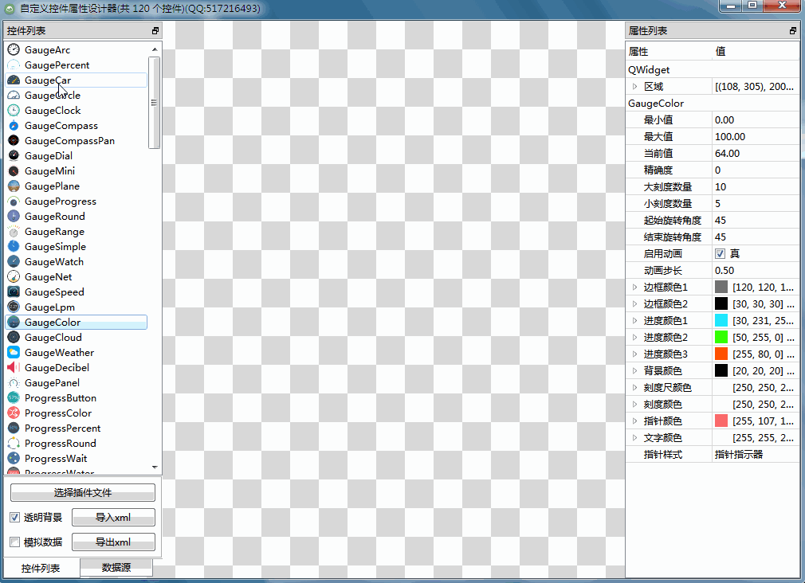

## 7 自定义曲线图柱状图
### 7.1 功能特点
1. 可设置X轴Y轴范围值。
2. 可设置背景颜色、文本颜色、网格颜色。
3. 可设置三条曲线颜色、颜色集合。
4. 可设置是否显示十字定位线，支持分别开启横向或者纵向定位线。
5. 可设置十字定位线的宽度、颜色。
6. 可设置是否显示数据点、数据点的大小。
7. 可设置是否填充背景颜色形成面积图。
8. 可设置各种交互模式，比如拖动、滚轮缩放等。
9. 可设置坐标轴间距、第二坐标系可见。
10. 提供接口setDataLine直接设置曲线，支持多条。
11. 提供接口setDataBar直接设置柱状图，支持多条形成堆积图。
12. 提供接口setLabs设置文本标签替代key，包括X轴和Y轴。
13. 提供清空数据、重绘图表、外部获取QCustomPlot对象等函数接口，这样就可以进行更加详细的参数设置。
14. 提供函数 start() 和 stop() 来模拟正弦曲线。
15. 可设置柱状图显示值、值的位置（顶部、中间、底部）、精确度、颜色。
16. 支持鼠标移动到数据点高亮显示数据点，显示数据提示信息。
17. 可设置提示信息位置：自动处理、顶部、右上角、右侧、右下角、底部、左下角、左侧、左上角等。
18. 可设置是否校验数据产生不同的背景颜色，柱状图的每根柱子都可以根据数据生成不同背景颜色，比如预警黄色、报警红色。
19. 可设置是否显示图例、图例位置、图例行数、图例单行显示。
20. 支持多条曲线、柱状图、柱状分组图、横向柱状图、横向分组图、柱状堆积图等。
21. 内置 N>15 套精美颜色，自动取颜色集合的颜色，省去配色的烦恼。
22. 每条柱状图都可以设置不同的颜，分组柱状图可以设置颜色交替。
23. Y轴数值支持百分比显示，可拓展改成成其他格式。
24. 内置平滑曲线算法，支持平滑曲线绘制，传入点集合即可。
25. 同时支持 QCustomPlot 1.3、2.0、2.1等后续所有版本。
26. 提供多坐标轴示例，一条曲线对应自己独立的坐标轴。
27. 提供多曲线图示例，一个曲线控件中绘制多条独立的曲线，曲线有自己的独立的坐标轴，非常适用于一个设备需要分开展示多条曲线的场景，而不是共用一套坐标系。
28. 支持Qt4-Qt6任意Qt版本，支持任意编译器、任意操作系统。

### 7.2 效果图

## 8 数据导入导出(xls/pdf)及打印示例
### 8.1 功能特点
1. 组件同时集成了导出数据到csv、xls、pdf和打印数据。
2. 所有操作全部提供静态方法无需new，数据和属性等各种参数设置采用结构体数据，极为方便。
3. 同时支持QTableView、QTableWidget、QStandardItemModel、QSqlTableModel等数据源。
4. 提供静态方法直接传入QTableView、QTableWidget控件，自动识别列名、列宽和数据内容。
5. 每组功能都提供单独的完整的示例，注释详细，非常适合各阶段Qter程序员。
6. 原创导出数据机制，不依赖任何office组件或者操作系统等第三方库，支持嵌入式linux。
7. 速度超快，9个字段10万行数据只需要2秒钟完成。
8. 只需要四个步骤即可开始急速导出海量数据比如100W条记录到Excel。
9. 同时提供直接写入数据接口和多线程写入数据接口，不卡主界面。
10. 可设置标题、副标题、表名。
11. 可设置导出数据的字段名、列名、列宽。
12. 可设置末尾列自动拉伸填充，默认拉伸更美观。
13. 可设置是否启用校验过滤数据，启用后符合规则的数据特殊颜色显示。
14. 可指定校验的列、校验规则、校验值、校验值数据类型。
15. 校验规则支持 精确等于==、大于>、大于等于>=、小于<、小于等于<=、不等于!=、包含contains。
16. 校验值数据类型支持 整型int、浮点型float、双精度型double，默认文本字符串类型。
17. 可设置随机背景颜色及需要随机背景色的列集合。
18. 支持分组输出数据，比如按照设备分组输出数据，方便查看。
19. 可设置csv分隔符、行内容分隔符、子内容分隔符。
20. 可设置边框宽度、自动填数据类型，默认自动数据类型开启。
21. 可设置是否开启数据单元格样式，默认不开启，不开启可以节约大概30%的文件体积。
22. 可设置横向排版、纸张边距等，比如导出到pdf以及打印数据。
23. 提供图文混排导出数据到pdf以及打印示例，自动分页，支持多图。
24. 提供一个打印样板中同时包括横向纵向排版示例。
25. 提供静态函数将控件截图导出到pdf文件。
26. 提供静态函数将图片转成pdf文件。
27. 提供静态函数将csv文件转成xls文件，支持列宽表名等参数设置。
28. 针对每列可分别设置字段对齐样式、内容对齐样式，包括左对齐、居中对齐、右对齐。
29. 灵活性超高，可自由更改源码设置对齐方式、文字颜色、背景颜色等。
30. 支持任意excel表格软件，包括但不限于excel2003-2021、wps、openoffice等。
31. 纯Qt编写，支持任意Qt版本+任意编译器+任意系统。

### 8.2 效果图

## 9 数据库集成应用通用功能
### 9.1 功能特点
1. 同时支持多种数据库比如odbc、sqlite、mysql、postgresql、sqlserver、oracle、人大金仓等。
2. 一个数据库类即可管理本地数据库通信，也支持远程数据库通信等。
3. 数据库线程支持执行各种sql语句，包括单条和批量。
4. 组件中的所有类打印信息、错误信息、执行结果都信号发出去。
5. 集成数据库通用翻页类（负责具体处理逻辑），搭配分页导航控件（负责外观），形成超级牛逼的翻页控件。
6. 集成数据库自动清理类，设定最大记录数后台自动清理早期数据。
7. 集成自定义委托类，支持复选框、文本框、下拉框、日期框、微调框、进度条等。
8. 同时支持Qt4-Qt6，亲测Qt4.6到Qt6.1任意版本，任意系统和编译器。
9. 本组件无故障 360天7乘24小时 运行在至少上万个现场，商业级别品质保证。
10. 每个类都对应完整详细的使用示例，注释详细，非常适合阅读学习。
11. 可以作为独立的程序运行，比如自动清理早期数据，同步数据到云端。
12. 全部线程处理，不卡界面，自动重连数据库。
13. 普通测试情况，sqlite数据库，数据库发生器每秒钟插入1000条记录约0.003秒钟，同时自动清理数据类每秒钟删除1000条记录约0.13秒，不同线程互不干扰。

### 9.2 数据库通信管理线程类
1. 可设置数据库类型，支持多种数据库类型。
2. 数据库类型包括但不限于odbc、sqlite、mysql、postgresql、sqlserver、oracle、人大金仓等。
3. 可设置数据库连接信息包括主机地址、用户信息等。
4. 具有自动重连机制，可设置是否检查连接以及检查间隔。
5. 支持单条sql语句队列，一般用于查询返回数据，每次插入一条执行一条。
6. 支持多条sql语句队列，一般用于远程提交数据，每次插入一条执行多条。
7. 支持批量sql语句队列，一般用于批量更新数据，每次插入多条执行多条。
8. 可设置队列最大数量，限定排队处理的sql语句集合。
9. 通过信号发出 打印信息、错误信息、查询结果。

### 9.3 数据库通用翻页类
1. 可设置每页多少行记录，自动按照设定的值进行分页。
2. 可设置要查询的表名、字段集合、条件语句、排序语句。
3. 可设置第一页、上一页、下一页、末一页、翻页按钮。
4. 可设置当前页、总页数、总记录数、每页记录数、查询用时标签页。
5. 多线程查询总记录数，数据量巨大时候不会卡主界面。
6. 建议条件字段用整型类型的主键，速度极快。
7. 提供查询结果返回信号，包括当前页、总页数、总记录数、查询用时等信息。
8. 可设置所有列或者某一列对齐样式例如居中或者右对齐。
9. 可增加列用于标识该条记录，设定列的位置、标题、宽度。
10. 提供函数直接执行第一页、上一页、下一页、末一页。
11. 提供函数直接跳转到指定页。
12. 根据是否第一页、末一页自动禁用对应的按钮。
13. 本控件是翻页功能类，和翻页控件navpage完美搭配，形成超级牛逼的翻页控件。

### 9.4 分页导航控件
1. 可设置页码按钮的个数。
2. 可设置字体大小。
3. 可设置边框圆角角度、大小、颜色。
4. 可设置正常状态背景颜色、文字颜色。
5. 可识别悬停状态背景颜色、文字颜色。
6. 可设置按下状态背景颜色、文字颜色。
7. 可设置选中状态背景颜色、文字颜色。
8. 可设置导航位置居中对齐、左对齐、右对齐。
9. 可设置是否显示提示标签控件。
10. 自动计算总页码数显示隐藏多余按钮。
11. 自动计算切换页码导航。
12. 和分页导航功能类无缝对接完美融合。

### 9.5 自动清理数据线程类
1. 可设置要清理的对应数据库连接名称和表名。
2. 可设置条件字段。
3. 可设置排序字段。
4. 可设置最大保留的记录数。
5. 可设置执行自动清理的间隔。
6. 后期支持多个数据库和多个表。
7. 建议条件字段用数字类型的主键，速度极快。
8. 增加统计用字段名称设置。
9. 增加自动清理文件夹，超过大小自动删除文件夹中早期文件。

### 9.6 自定义委托全家桶
1. 可设置多种委托类型，例如复选框、文本框、下拉框、日期框、微调框、进度条等。
2. 可设置是否密文显示，一般用于文本框。
3. 可设置是否允许编辑，一般用于下拉框。
4. 可设置是否禁用，一般用来禁用某列。
5. 可设置数据集合，比如下拉框数据集合。
6. 提供值变化信号，比方说下拉框值改动触发。
7. 可设置数据校验自动产生不同的图标。
8. 支持设置校验列、校验规则、校验值、校验成功图标、校验失败图标、图标大小。
9. 可设置校验数据产生不同的背景颜色和文字颜色。
10. 校验规则支持 == > >= < <= != contains，非常丰富。
11. 复选框自动居中而不是左侧，切换选中状态发送对应的信号。
12. 可设置颜色委托，自动根据颜色值绘制背景颜色，自动设置最佳文本颜色。
13. 可设置按钮委托，自动根据值生成多个按钮，按钮按下发送对应的信号。
14. 当设置了委托列时自动绘制选中背景色和文字颜色。
15. 可设置关键字对照表绘制关键字比如原始数据是 0-禁用 1-启用。
16. 可设置复选框对应的映射选中不选中关键字。
17. 根据不同的委托类型绘制，可以依葫芦画瓢自行增加自己的委托。
18. 所有功能封装成1个类，核心代码不到500行，使用极其方便友好。

### 9.7 效果图
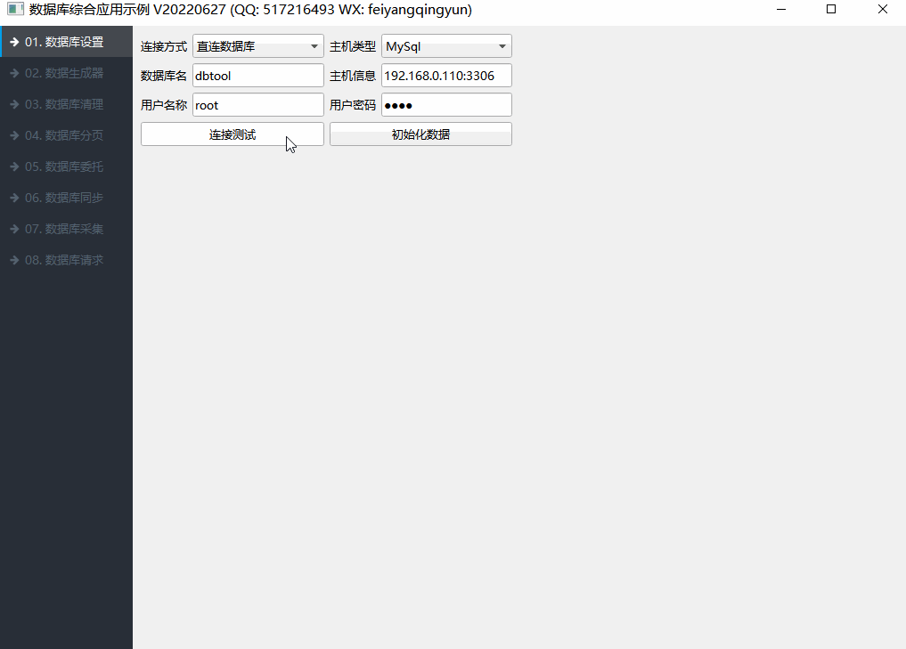

## 10 图片及视频TCP/UDP网络传输
### 10.1 功能特点
1. 多线程收发图片数据和解析图片数据，不卡主界面。
2. 同时支持TCP和UDP两种模式，封装了TCP模式以及UDP模式的客户端类和服务端类。
3. 图片传输客户端同时支持发送到多个服务端，可以作为一个教师机同屏发送到多个学生机的应用场景。
4. 同时支持多个客户端同时往服务端发送图片，服务端每个连接都会自动开辟线程收发和解析图片数据。
5. 自定义label控件信号槽机制绘制图片，不卡主界面。
6. 自带心跳机制判断离线，自动重连服务器，可设置超时时间。
7. 每个消息都有唯一的消息标识uuid，服务端收到以后会返回对应的uuid消息表示收到，客户端可以根据此返回消息判断服务端解析成功，不用再发，这样可以确保发出去的数据服务器接收到了并解析成功。
8. 每个消息都有唯一的图片标识flag，相当于ID号，根据此标识判断需要解析显示到哪个界面。
9. 图片以base64的字符串格式发送，接收端接收到base64字符串的图片数据解码后重新生成图片。
10. 所有数据的收发都有信号发出去，方便输出查看。
11. 都提供单例类，方便只有一个的时候直接使用无需new。
12. 采用自定义的xml协议，可以自由拓展其他属性字段比如带上图片内容等。

### 10.2 效果图

## 11 百度地图综合应用（在线+离线+区域+下载）
### 11.1 省市区域地图封装类功能特点
1. 同时支持闪烁点图、迁徙图、区域地图、世界地图、仪表盘等。
2. 可以设置标题、提示信息、背景颜色、文字颜色、线条颜色、区域颜色等各种颜色。
3. 可设置城市的名称、值、经纬度 集合。
4. 可设置地图的放大倍数、是否允许鼠标滚轮缩放。
5. 内置世界地图、全国地图、省份地图、地区地图，可以精确到县，所有地图全部离线使用。
6. 内置了各省市json数据文件转js文件功能，如有数据更新自行转换即可，支持单个文件转换和一键转换所有文件。
7. 内置了从json文件或者js文件获取该区域的所有名称和经纬度信息集合的功能，可以通过该方法获取到信息用来显示。
8. 依赖浏览器组件显示地图，提供的demo支持webkit/webengine/miniblink/ie 多种方式加载网页。
9. 采用miniblink浏览器内核打通了Qt5.6及后续版本+mingw编译器缺少浏览器模块的遗憾，使得整个项目支持所有Qt版本，亲测4.7到6.2等任意版本。
10. 闪烁点迁徙图等设置的点支持单独设置颜色。
11. 提供接口直接获取点击的点相关信息，方便程序联动处理。
12. 拓展性极强，可以依葫芦画瓢自行增加各种精美的echarts组件，做出牛逼的效果。
13. 内置的仪表盘组件提供交互功能，demo演示中包含了对应的代码。
14. 函数接口友好和统一，使用简单方便，就一个类。
15. 支持任意Qt版本、任意系统、任意编译器。

### 11.2 百度地图封装类功能特点
1. 同时支持在线地图和离线地图两种模式。
2. 同时支持webkit内核、webengine内核、miniblink内核、IE内核。
3. 支持设置多个标注点，信息包括名称、地址、经纬度。
4. 可设置地图是否可单击、拖动、鼠标滚轮缩放。
5. 可设置协议版本、秘钥、主题样式、中心坐标、中心城市、地理编码位置等。
6. 可设置地图缩放比例和级别，缩略图、比例尺、路况信息等控件的可见。
7. 支持地图交互，比如鼠标按下获取对应位置的经纬度。
8. 支持查询路线，可设置起点位置、终点位置、路线模式、路线方式、路线方案（最少时间、最少换乘、最少步行、不乘地铁、最短距离、避开高速）。
9. 可显示点线面工具，可直接在地图上划线、点、矩形、圆形等。
10. 可设置行政区划，指定某个城市区域绘制图层，在线地图自动输出行政区划边界点集合到js文件给离线地图使用。
11. 可静态或者动态添加多个覆盖物。支持点、折线、多边形、矩形、圆形、弧线、点聚合等。
12. 提供函数接口处理经纬度解析成地址和地址解析成经纬度坐标。
13. 提供的demo直接可以单独选点执行对应的处理比如路线查询。
14. 可以拿到路线查询到的点坐标信息集合，比如用于机器人坐标导航等。
15. 封装了丰富的函数比如删除指定点和所有点，删除指定覆盖物和所有覆盖物等。
16. 标注点弹框信息可以自定义内容，标准html格式。
17. 标注点单击事件可选 0-不处理 1-自己弹框 2-发送信号。
18. 标注点可设置动画效果 0-不处理 1-跳动 2-坠落
19. 标注点可设置本地图片文件等。
20. 函数接口友好和统一，使用简单方便，就一个类。
21. 支持js动态交互添加点、删除点、清空点、重置点，不需要刷新页面。
22. 支持任意Qt版本、任意系统、任意编译器。

### 11.3 离线地图下载类功能特点
1. 多线程同步下载多级别瓦片地图，不卡界面。
2. 内置多个离线地图下载请求地址，自动随机选择一个发送请求。
3. 下载地图类型同时支持街道图和卫星图。
4. 自动计算可视区域或者行政区域的下载瓦片数量。
5. 下载的级别可以自定义范围和选择。
6. 每个瓦片下载完成都发送信号通知，参数包括下载用时。
7. 可设置下载最大超时时间，超过了则丢弃跳到下一个下载任务。
8. 实时显示下载进度，以及当前级别已经下载的瓦片数和总瓦片数。
9. 下载过程中可以停止下载，下载完成自动统计总用时。
10. 内置经纬度和屏幕坐标互相转换函数。
11. 目前支持百度地图，其他地图比如谷歌地图、腾讯地图、高德地图可以定制。
12. 函数接口友好和统一，使用简单方便，就一个类。
13. 支持任意Qt版本、任意系统、任意编译器。

### 11.4 省市轮廓下载类功能特点
1. 定时器排队下载省市轮廓图点坐标集合存储到JS文件。
2. 支持一个行政区域多个不规则区域下载。
3. 自动计算行政区域的下载轮廓数量。
4. 可精确选择省份、市区、县城，也可直接输入行政区域的名称。
5. 可以设置下载间隔、随时开始下载和停止下载。
6. 提供编辑边界功能，可以直接在地图上编辑好不规则区域的点集合，然后获取边界点集合数据，这个可以用来自己绘制区域拿到数据，比如某个乡镇甚至某个小区的行政区域数据，很牛逼。

### 11.5 效果图

## 12 网络请求客户端/服务器
### 12.1 功能特点
1. 支持多个客户端连接并发同时处理，
2. 可设置http请求是长连接还是短连接，默认长连接。
3. 支持多种回复数据格式，其中包括网页内容、json数据等。
4. 服务端示例中同时包含读取文件回复、读取数据库回复。
5. 支持8种配色方案（暗黑、灰黑、深绿、浅黄、深蓝、深黑、暗蓝、默认）。
6. 客户端可指定请求地址，服务端可指定网卡和端口进行监听。
7. 所有请求和连接都有计数，所有在线请求的IP和端口都显示在表格中。
8. 可自由拓展增加权限校验等，作为一个http请求服务器。
9. 代码框架整洁，注释完整，支持任意Qt版本、任意编译器、任意操作系统。

### 12.2 效果图
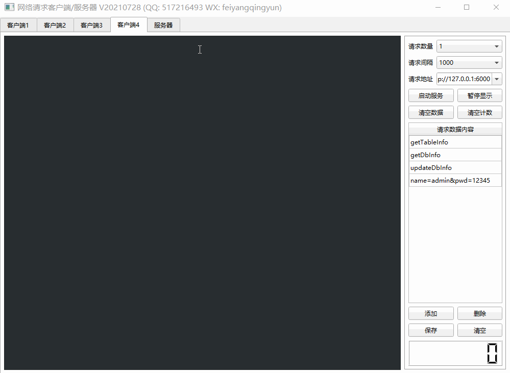

## 13 自定义委托全家桶
### 13.1 功能特点
1. 可设置多种委托类型，例如复选框/文本框/下拉框/日期框/微调框/进度条等。
2. 可设置是否密文显示，一般用于文本框。
3. 可设置是否允许编辑，一般用于下拉框。
4. 可设置是否禁用，一般用来禁用某列。
5. 可设置数据集合，比如下拉框数据集合。
6. 提供值变化信号，比方说下拉框值改动触发。
7. 可设置数据校验自动产生不同的图标。
8. 支持设置校验列/校验规则/校验值/校验成功图标/校验失败图标/图标大小。
9. 可设置校验数据产生不同的背景颜色和文字颜色。
10. 校验规则支持 == > >= < <= != contain，非常丰富。
11. 复选框自动居中而不是左侧，切换选中状态发送对应的信号。
12. 可设置颜色委托，自动根据颜色值绘制背景颜色，自动设置最佳文本颜色。
13. 可设置按钮委托，自动根据值生成多个按钮,按钮按下发送对应的信号。
14. 当设置了委托列时自动绘制选中背景色和文字颜色。
15. 可设置关键字对照表绘制关键字比如原始数据是 0-禁用 1-启用。
16. 可设置复选框对应的映射选中不选中关键字。
17. 根据不同的委托类型绘制，可以依葫芦画瓢自行增加自己的委托。
18. 所有功能封装成1个类不到500行代码，使用极其方便友好。

### 13.2 应用场景
1. 某个字段需要提供下拉框进行选择，下拉框可选是否允许编辑。
2. 某个字段需要提供密码框进行输入，密文显示字段值。
3. 某个字段需要提供日期框下拉选择日期时间。
4. 某个字段需要提供微调框设定值。
5. 某个字段需要提供进度条显示字段值。
6. 某个字段列需要禁用。
7. 各种委托控件可以设置初始的数据集合，比如下拉框。
8. 各种委托控件在值发生变化的时候发出valuechanged信号，比如下拉框选择声音文件的时候进行播放试听，微调框值改变的时候联动其他控件进行处理等。
9. 某个字段根据设定的规则进行数据校验自动产生不同的图标显示，比如报警红色图标/正常绿色图标，一目了然。同时可设置校验列/校验规则/校验值/校验成功图标/校验失败图标/图标大小。
10. 某个字段根据设定的规则进行数据校验自动绘制不同的背景颜色醒目显示，可设定规则包括 == > >= < <= != contains，可设置符合要求的内容文字颜色/背景颜色。
11. 某个字段需要根据内容显示复选框（自动居中），比如内容是 0/禁用/false 等复选框不选中，1/启用/true 等复选框选中，具体选中不选中对应的内容可自定义。
12. 某个字段需要根据内容重新替换显示成自定义的内容，比如值是0而需要显示成“不符合”字样，1显示成“符合”字样。对应的内容替换规则可设置关键字对照表。
13. 某个字段需要根据颜色值显示对应的颜色，同时可以单击选中进行颜色选择。
14. 某列需要显示操作按钮，按钮的个数/文字集合可设定，根据设定的文字集合平分宽度绘制按钮，单击某个按钮发送对应的按钮单击信号，带按钮索引以及行列，用于用户自行处理。
15. 一个类通用所有需要委托的场景，相当于一个轮子用在所有项目中，不需要单独再去写不同的委托类。
16. 一个类通用所有支持委托的控件，比如QTableView/QTableWidget/QListView/QTreeWidget/QListWidget等。

### 13.3 效果图

## 14 人脸识别综合应用(在线+离线+嵌入式)
### 14.1 功能特点
1. 支持的功能包括人脸识别、人脸比对、人脸搜索、活体检测等。
2. 在线版还支持身份证、驾驶证、行驶证、银行卡等识别。
3. 在线版的协议支持百度、旷视，离线版的支持百度，可定制。
4. 除了支持X86架构，还支持嵌入式linux比如contex-A9、树莓派等。
5. 每个功能的执行除了返回结果还返回执行用时时间。
6. 多线程处理，通过type控制当前处理类型。
7. 支持单张图片检索相似度最高的图片。
8. 支持指定目录图片用来生成人脸特征值文件。
9. 可设置等待处理图片队列中的数量。
10. 每次执行都有成功或者失败的信号返回。
11. 人脸搜索的返回结果包含了原图+最大相似度图+相似度等。
12. 人脸比对同时支持两张图片和两个特征值比对。
13. 相关功能自定义一套协议用于客户端和服务端，可以通过TCP通信进行交互。
14. 自定义人脸识别协议非常适用于中心一台服务器，现场若干设备请求的场景。
15. 每个模块全部是独立的一个类，代码整洁、注释完善。

### 14.2 人脸识别协议
1. 离线使用，同时支持百度的离线包和嵌入式linux人脸识别静态库。
2. 支持多个连接并发，自动排队处理，返回的时候带上唯一标识区分。
3. 传入单张图片返回人脸区域。
4. 传入单张图片返回人脸特征值。
5. 传入单张图片或者多张图片返回是否是活体。
6. 传入两张图片返回比对结果。
7. 传入两个特征值返回比对结果。
8. 传入单张图片添加人脸。
9. 指定唯一标识符删除人脸。
10. 传入单张照片返回相似度最大的人脸信息。
11. 修改人脸服务的配置参数比如是否快速查找、人脸占比等。

### 14.3 效果图
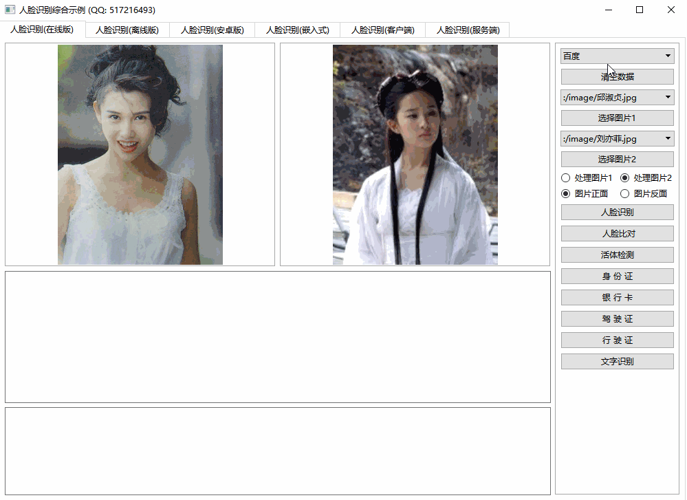

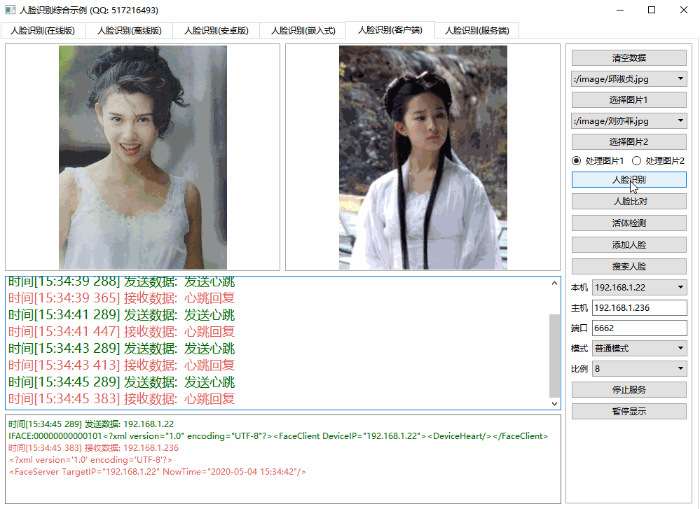

## 15 硬件综合应用(热敏打印+身份证+短信猫)
### 15.1 串口热敏打印
1. 标准热敏打印协议解析，无依赖，支持任意系统。
2. 可打印各种文字信息比如访客单、报警信息等。
3. 可打印条形码即一维码。
4. 可打印二维码，设置二维码尺寸。
5. 支持多线程打印图片。
6. 可设置打印机的工作模式 0-标准模式 1-翻页模式。
7. 可设置各种边距比如行间距、字符间距、左边距等。
8. 可设置字体信息、字符集、文字对齐、加粗等。
9. 可设置串口号和波特率，不同厂家波特率可能不一致。

### 15.2 身份证阅读器
1. 标准身份证阅读协议解析，无依赖，支持任意系统。
2. 可读取身份证文字信息，比如姓名、性别、名族等。
3. 可读取身份证头像，不同厂家库不一样。
4. 文字信息返回一个信号，头像一个信号，完美。
5. 支持嵌入式linux系统，包括32位64位。
6. 整体流程就是寻找身份证、选取身份证、读身份证信息。

### 15.3 短信猫调试器
1. 标准AT命令协议解析，无依赖，支持任意系统。
2. 可设置收发短信模式 0-text模式 1-pdu模式。
3. 可批量发送短信以及支持长短信发送。
4. 可指定序号读取短信和删除短信。
5. 可一次性删除所有短信。
6. 可检测设备是否运行正常。
7. 支持中文短信发送。
8. 支持拨打电话+挂断电话+接听来电。
9. 可识别用户按键反馈，比如电话另一端按下了什么按键。
10. 支持批量发送给多个号码。

### 15.4 效果图
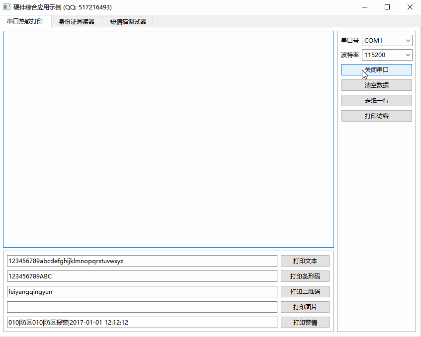

## 16 多线程文件传输工具
### 16.1 功能特点
1. 多线程收发文件，支持加密传输。
2. 接收端支持监听端口接收文件和主动连接服务器接收文件两种方式。
3. 按照 文件开始符+文件大小+文件内容+文件结束符 逐个分包接收。
4. 可对接收的加密过的文件包进行解密输出。
5. 如果采用连接服务器方式接收文件可指定请求文件。
6. 接收端请求文件的形式可以作为通用的程序升级方案。
7. 进度条实时更新收发文件的进度。
8. 发送端可设置每个包最大大小即切片分包数量。
9. 发送端可对文件的每个包进行加密传输。
10. 发送端支持对包进行合并发送。
11. 可指定目录对客户端发来的请求文件进行搜索。
12. 每个功能独立的一个类，接口清晰友好，使用方便。
13. 支持任意Qt版本、任意系统、任意编译器。

### 16.2 效果图
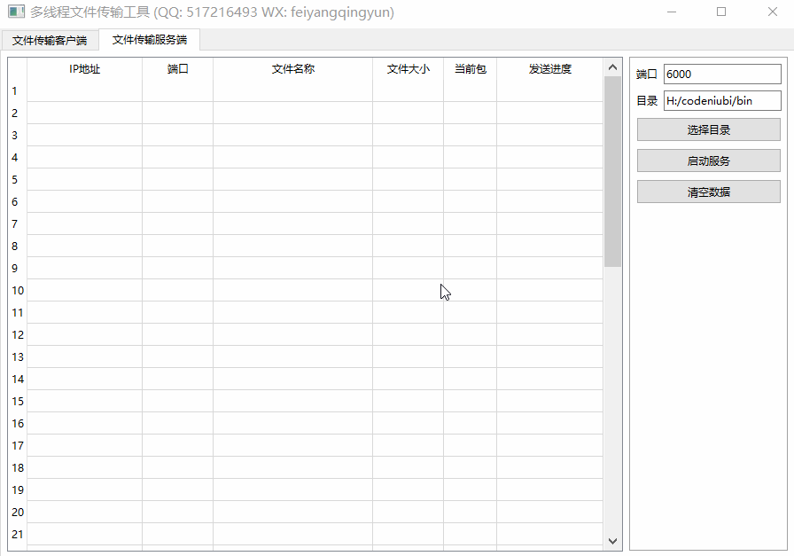

## 17 安卓综合应用示例
### 17.1 功能特点
1. 封装了通用的Qt安卓组件，打通了常规与java交互机制。
2. 动态切换横屏竖屏及获取当前横屏竖屏状态。
3. 支持手机震动、拨打电话、发送短信。
4. 支持moketoast临时消息、notify顶部任务栏消息。
5. 支持安卓系统层的选择文件，包括相册文件、本地图片、本地音频、本地视频、本地联系人等，返回的路径并不是默认的uri而是转换解析后的正确的路径。
6. 封装了Qt的文件选择及保存对话框，自动根据横屏竖屏调整弹出框大小和位置到适中。
7. 统一的通用的接收从安卓发过来的数据信号，比如选择文件后的路径、抓拍图片完成等信号通知，通过type区分类型。
8. 支持打开系统拍照程序，拍照后返回抓拍的原始图片，非缩略图。
9. 提供调用jar文件示例，调用jar包中的函数，执行返回结果。
10. 提供camera示例，支持切换前置后置摄像头、支持保存录像文件、可调整焦距、抓拍图片、设置图像拉伸策略、设置画面旋转角度、自动对焦等。
11. 提供了video示例，可以播放本地音视频文件。
12. 提供解析二维码示例，可开启自动抓拍识别。
13. 支持全屏显示，屏幕常亮，后期增加开机启动、屏幕唤醒、服务进程等功能。
14. 自动识别电池电量的变化，包括当前是否在充电。
15. 通用广播消息拦截，识别电量变化、存储器挂载、屏幕打开关闭等。
16. 支持多摄像头同时显示和录像，比如同时3路，前提是系统支持多开摄像头。
17. 可选图片传输模块，抓拍图片和二维码解析结果发送到服务器，提供图片传输服务器解析示例。
18. 内置的与java交互示例非常丰富，既有通过实例调用类的方法，也有直接调用静态方法，既有直接调用java内部类，也有通过Java类中转调用方式。
19. 演示交互示例包括私有方法、公有静态方法、无参数无返回值、有参数无返回值、无参数有返回值、有参数有返回值、多个不同类型参数等。

### 17.2 效果图

## 18 音频综合应用示例
### 18.1 功能特点
1. 自动计算音频振幅，绘制音频振幅曲线和音频数据曲线。
2. 支持音频录制，可选音频输入设备、采样频率、通道等参数，Qt5默认保存wav格式，Qt6默认保存mp3格式，Qt6可选wma、aac等格式。
3. 提供音频发送示例，将采集到的音频数据通过TCP或UDP发出去。
4. 提供音频接收示例，将网络TCP或UDP收到的音频数据播放出来。
5. 音频发送和接收，相当于语音对讲，响应延迟小于0.2s，实时性极高。
6. 可以编译成手机版本，形成手机和电脑等端语音对讲功能。
7. 可以拓展作为视频监控的语音对讲模块。
8. 源码支持Qt4、Qt5、Qt6，兼容所有版本。

### 18.2 效果图

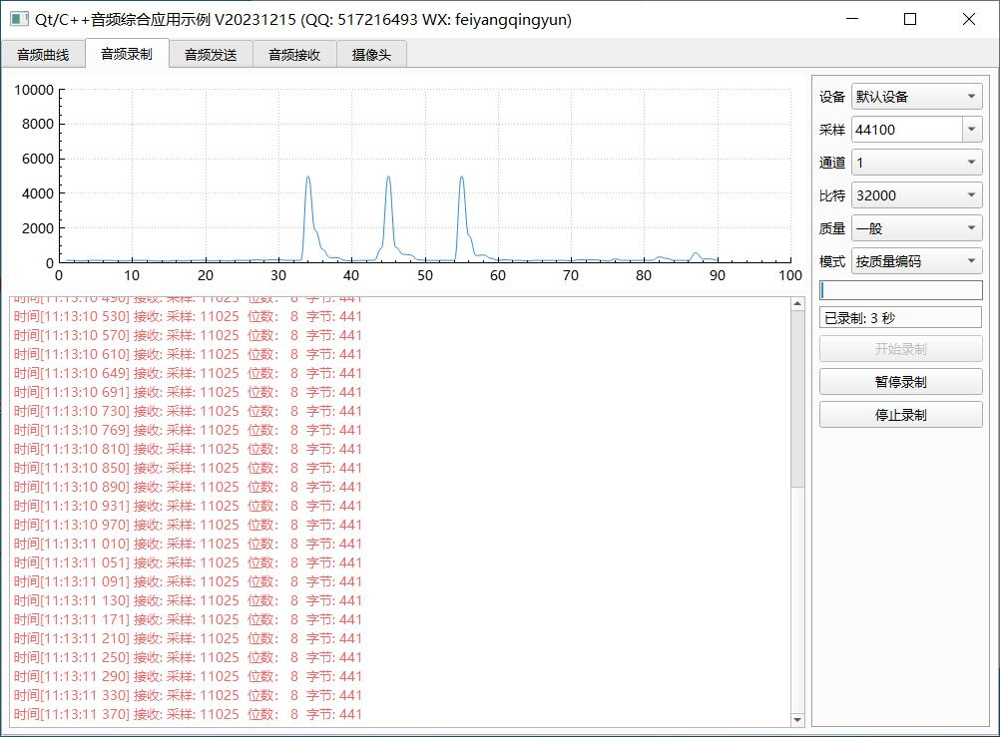
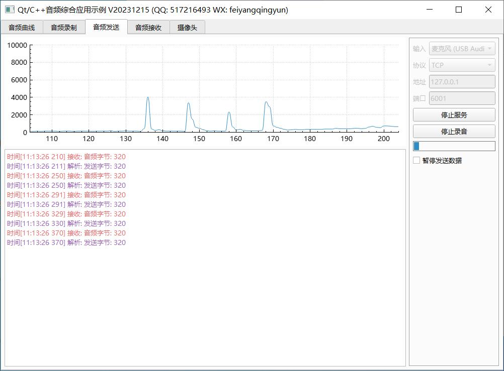
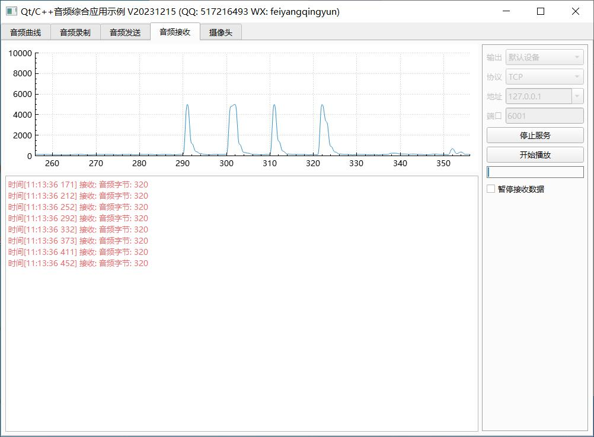
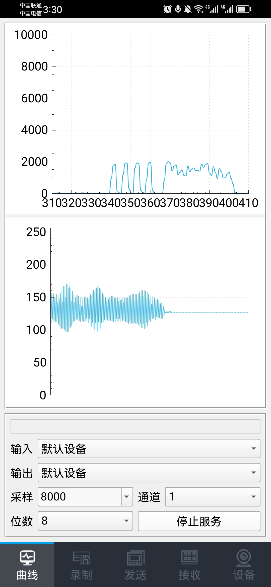

## 19 本地摄像头综合应用示例
### 19.1 功能特点
1. 同时支持 QCamera、ffmpeg、v4l2 三种内核解析本地摄像头。
2. 提供函数 findCamera 自动搜索环境中的所有本地摄像头设备，搜索结果信号发出。
3. 支持自动搜索和指定设备两种模式，自动搜索模式下会将搜索到的第一个设备作为当前设备打开。
4. 支持同时打开多路设备，亲测4路，受限于具体的环境比如带宽。
5. 支持自动重连，默认开启，失败后会自动重新搜索和尝试打开。
6. ffmpeg方案、v4l2方案都支持回调模式（采集后转成QImage绘制）和句柄模式（采集后YUV数据GPU绘制，性能高）。
7. 视频显示位置自动调整算法，当视频分辨率超过显示控件大小则等比例缩放居中显示，不超过则原尺寸居中显示，还可设置拉伸填充显示。（自动调整、等比例缩放、拉伸填充）。
8. 可选不同的分辨率来打开摄像头，支持 160x120、320x240、640x480、800x600、1280x720、1280x960、1920x1080 等。
9. 可选不同的帧率来打开摄像头，支持 0（采用默认值）、5、、10、15、20、25、30 等。
10. 支持抓拍截图，传入文件名则自动保存截图文件，不传入则将图片数据QImage信号发出。
11. 提供函数接口 开始播放play、停止播放stop、暂停播放pause、继续播放next。
12. 支持动态热插拔加载，包括自动读取所有设备名称到下拉框。
13. 支持录像文件存储（目前仅限QCamera方案），提供开始录像recordStart、暂停录像recordPause、停止录像recordStop 等函数。
14. 提供二维码示例，自动采集画面识别二维码，支持自动将识别到的二维码重新生成大图，支持选择图片文件解析二维码，支持手动输入文本内容生成二维码。
15. 提供图片传输示例，自动将打开的摄像头视频实时传输出去，服务器端接收后解析显示。次方案可以作为将本地的摄像头实时画面远程传输，比如嵌入式板子上的摄像头画面传输到PC端显示。
16. 支持等比例拉伸填充显示，画面宽高小于显示控件的宽高则以原视频大小为准，大于则按照显示控件的尺寸等比例缩放居中。
17. 视频控件悬浮条自带开始和停止录像切换、声音静音切换、抓拍截图、关闭视频等功能。
18. 音频组件支持声音波形值数据解析，可以根据该值绘制波形曲线和柱状声音条，默认提供了声音振幅信号。
19. 内核ffmpeg支持音视频合并保存到MP4文件。
20. 代码框架和结构优化到极致，性能彪悍，持续迭代更新升级。
21. 源码支持Qt4、Qt5、Qt6，兼容所有版本。

### 19.2 效果图
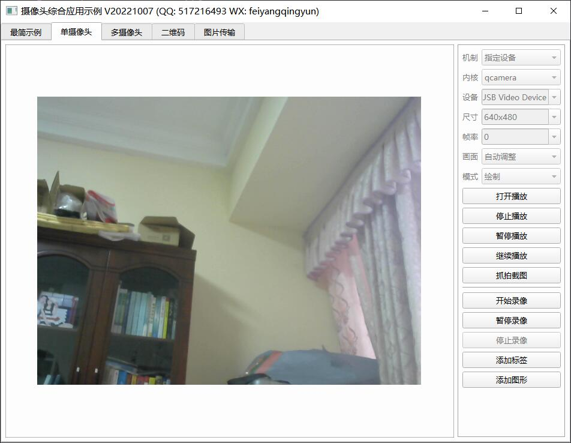
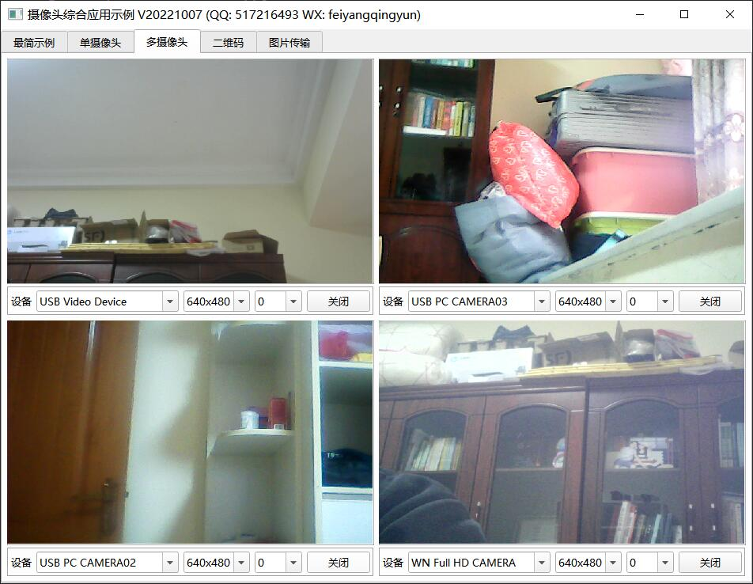

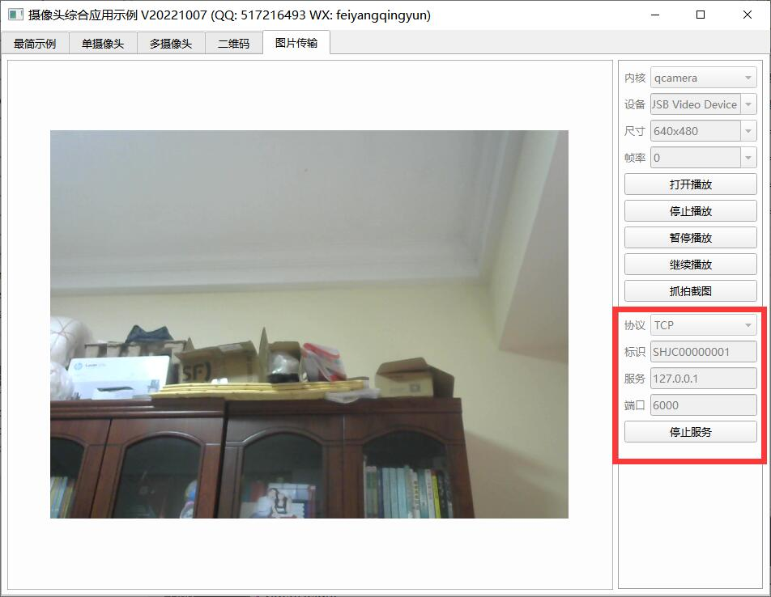
