## 1、编译说明
1. 编译完成以后记得将源码下的file目录下（切记是file目录下而不是file目录）的所有文件复制到可执行文件同一目录下即可。
2. 可执行文件在源码同级目录下的bin目录，和core_map目录同级。
3. 在线地图一般都需要对应的秘钥，本源码中内置的地图秘钥是本人的秘钥字符串，由于对应地图官方并发量有限制，建议换成自己的秘钥体验更加。可以通过函数接口setVersionKey设置秘钥字串。
4. 百度地图申请步骤可以参考 https://blog.csdn.net/wodegeCSDN/article/details/130224845 。
5. 本地图组件通过浏览器控件加载，所以依赖浏览器控件。由于不同的Qt版本提供的浏览器控件不同，甚至部分Qt版本比如mingw的Qt不提供浏览器控件，所以专门提供了core_webview组件，该组件封装了webkit/webengine/miniblink三大浏览器内核，会自动根据Qt套件识别出使用哪种浏览器内核，比如windows上mingw版本的Qt会自动采用miniblink内核，linux系统会采用webengine内核。如果有疑问那其他系统的miniblink没有怎办？这个不用考虑，因为其他系统Qt都自带了浏览器控件，不存在这个问题。就windows上的mingw版本的Qt才缺少这个组件。
6. 如果启用的是miniblink内核，则需要将miniblink的动态库拷贝到可执行文件同一目录。dll_miniblink下载链接: https://pan.baidu.com/s/13LDRu6mXC6gaADtrGprNVA 提取码: ujm7
7. 特别提示：路线规划和周边搜索相关功能只能在线使用，因为相关算法放在服务器。
8. 如果需要加载国外的地图带英文以及当地语种，最佳组合是使用天地图离线模式加上谷歌地图瓦片。

## 2、离线地图
1. 想要加载离线地图，前提是要有下载好的离线地图文件，也就是一张张的图片文件。离线地图也叫瓦片地图，这些文件可以使用本项目的离线地图下载模块下载，也可以用第三方的瓦片地图下载器下载。
2. 如果暂时没有离线地图文件，可以直接下载提供好的离线地图文件测试。离线地图网盘地址：https://pan.baidu.com/s/1ZxG-oyUKe286LPMPxOrO2A 提取码：o05q  文件名：tiles.7z是徐汇区虹漕园精简版离线地图，bin_map_tiles.tar.gz 是上海市离线地图。
3. 将离线地图文件目录拷贝到可执行文件所在的对应地图内核目录下（mapbaidu/mapgaode/maptian/mapgoogle等），和map_load.js文件同一级目录。
4. **离线地图目录可能有三个文件夹，tiles表示街道图，tiles_hybrid表示卫星图，tiles_self表示自定义图层，比如需要混合路线图等。天地图比较特殊，分6个目录，对应官网定义的6种地图。街道图底图是vec_w，街道图路网是cva_w，卫星图底图是img_w，卫星图路网是cia_w，地形图底图是ter_w，地形图路网是cta_w。**
5. 同一种地图内核的离线地图文件通用。网盘上提供的瓦片地图是使用本项目的离线地图下载模块下载的，也可以自己用万能地图下载器下载，对应替换就行。
6. 瓦片地图就是一张张图片文件，格式可以自定义，如果格式不一样可能会加载失败，需要手动修改。比如百度地图内核需要打开/mapbaidu/map_load.js文件，将.png改成.jpg保存即可。
7. 经过大量的测试对比发现，无论哪种地图内核，卫星图是jpg格式，其他的比如街道图和叠加图都是png格式。
8. 如果想要既有全国地图的主要部分，又要有局部精确地图，可以将全国地图下面的文件复制到局部地图中，可以同名文件替换，这样就不会说在精确地图缩小到一定级别的时候周围出现空缺难看。
9. 由于整个中国的所有层级的离线地图文件非常巨大，至少是N个TB级别的，强烈建议按需下载，比如如果你的项目只需要在上海市使用，你只需要下载整个上海市的就好，不然打包发布的时候异常的巨大。一般的做法是全国的地图下载到12级别就好，然后需要的地区的地图下载12-19级别的。
10. 如果需要天地图离线地图加载谷歌瓦片文件（为什么会有这么奇怪的组合？其实一点不奇怪，因为只有谷歌地图的国外的地图有英文和当地的语种，但是谷歌的离线api接口不全，天地图的离线api接口很全，而且天地图是地球坐标系），先要下载好谷歌的瓦片文件，然后将下载好的街道图瓦片放到天地图的目录下maptian/tiles_vec_w，还需要复制一份一模一样的拷贝到maptian/tiles_cva_w。因为天地图是每一种地图都是分开两个目录的，都有底图和叠加层。

## 3、代码使用
1. 将core_map（地图组件）/core_webview（浏览器组件）这两个组件目录拷贝到你的项目目录，并在pro中填写引入代码加入到你的项目中。$$PWD/../表示上级目录。
```cpp
include ($$PWD/../core_map/core_map.pri)
include ($$PWD/../core_webview/core_webview.pri)
```
2. 在pro中启用地图内核，比如百度地图内核对应需要在pro文件中增加一行定义  DEFINES += baidux，天地图内核对应 DEFINES += tianx
3. 引入头文件。
```cpp
#include "webview.h"
#include "maphelper.h"
#include "mapobjbase.h"
```
4. 新建一个窗体，上面放一个布局，推荐用表格布局 gridlayout，可以放多个浏览器控件。
5. 实例化浏览器类和地图类。
```cpp
//实例化浏览器控件
WebView *webView = new WebView(this);
//加入到布局
webView->setLayout(ui->gridLayout);
//实例化地图类/参数2表示何种地图内核
MapObjBase *mapObj = MapHelper::getMapObj(this, MapCore_BaiDu);
//传入网页控件用于执行函数
mapObj->setWebView(webView);
//直接加载地图
mapObj->load();
//异步加载地图
//QMetaObject::invokeMethod(mapObj, "load", Qt::QueuedConnection);
```
6. 所有地图相关的函数接口在MapObjBase类中，可以打开mapobjbase.h查看具体说明。
7. 地图中大部分的功能都是通过执行js函数来触发，比如添加标注、添加折线图等。这些必须严格按照提供的js函数名称和参数来执行。对应示例都提供了相关的调用方法。
8. 部分函数接口。
```cpp
QString js;
//设置地图级别(值越大放大/越小缩小)
js = "setZoom(9)";
//街道图卫星图切换(0-街道图/1-卫星图/2-混合图)
js = "setMapType(1)";
//添加一个标记(北京那边)
js = QString("addMarker('测试点', '测试地址', '', '', 100, '%1', 2)").arg("116.475836,40.251114");
//最终通过浏览器控件执行
webView->runJs(js);
```
9. 浏览器组件使用示例。
```cpp
//实例化浏览器控件
WebView *webView = new WebView(this);
//加入到布局
webView->setLayout(ui->verticalLayout);
//打开网址
webView->load("https://www.baidu.com", "", "");
```
10. 特别强调，浏览器控件的加载，会自动根据布局的大小调整自己的大小，如果窗体还没显示就调用了load，那么很可能地图出不来，原因是因为窗体没显示的时候，Qt中所有控件的尺寸都是不确定的，只有显示后才是确定的，所以一定要显示后再去加载地图。这种现象主要发生在需要主动调整浏览器控件尺寸的浏览器控件中，比如miniblink或者cef，如果是webkit或者webengine就不需要。
```cpp
int main(int argc, char *argv[])
{
    QApplication a(argc, argv);
    frmMain w;
    w.show();
    //下面表示异步加载地图
    QMetaObject::invokeMethod(&w, "loadMap", Qt::QueuedConnection);
    return a.exec();
}
```

## 4、使用说明
### 4.1 省市区域
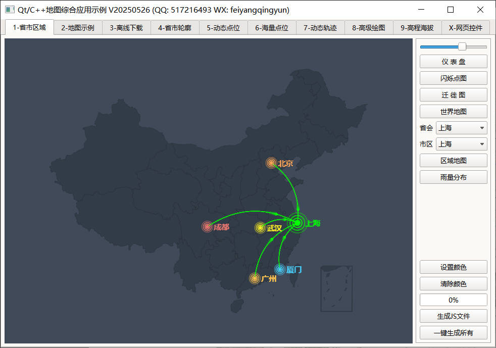
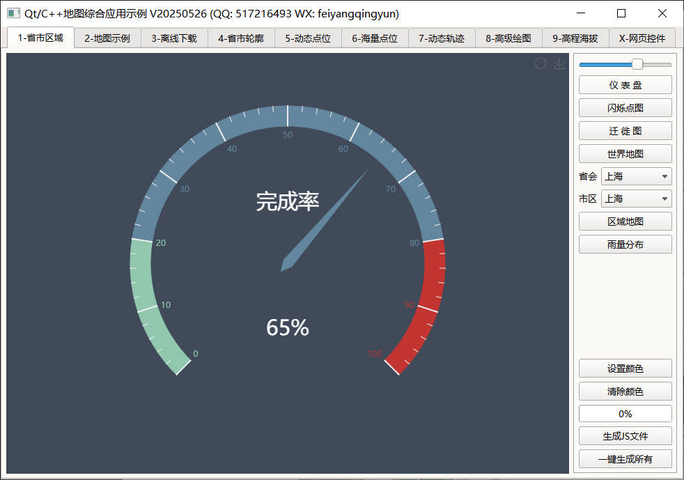


1. 本组件采用echart编写，离线使用。单击对应的按钮可以切换到对应的效果演示。
2. 单击仪表盘按钮切换到一个标准的仪表盘示例，可以拉动上面的滑块调整对应的值。
3. 单击闪烁点图会切换到闪烁点图示例，每个闪烁点都可以设置不同的颜色和值大小，值越大点越大。
4. 单击迁徙图会切换到迁徙图示例，多个点往一个点迁徙，有箭头指向，可以设置不同的颜色和值大小，值越大点越大。
5. 单击世界地图会切换到世界地图示例，有七大洲的轮廓图，同样的也可以设置不同经纬度值的颜色和大小。
6. 下拉选择好对应的省会以及市区，再单击区域地图会切换到对应选择的市区的轮廓图，全国的市区的轮廓图都有。
7. 单击雨量分布会切换到指定的一个区域的雨量分布图，每个县都不同颜色点以及雨量值，鼠标移上去有悬停显示。
8. 单击设置颜色按钮前，需要切换到闪烁点图或者迁徙图，通过js函数去修改某个点的颜色。清除颜色按钮同理。
9. 生成js文件按钮用于将网上下载的区域的json文件转换成echart中可以直接识别的js文件。一键生成所有按钮用于将这个json目录的文件全部批量转成成js文件。

### 4.2 地图示例
#### 4.2.0 基础功能
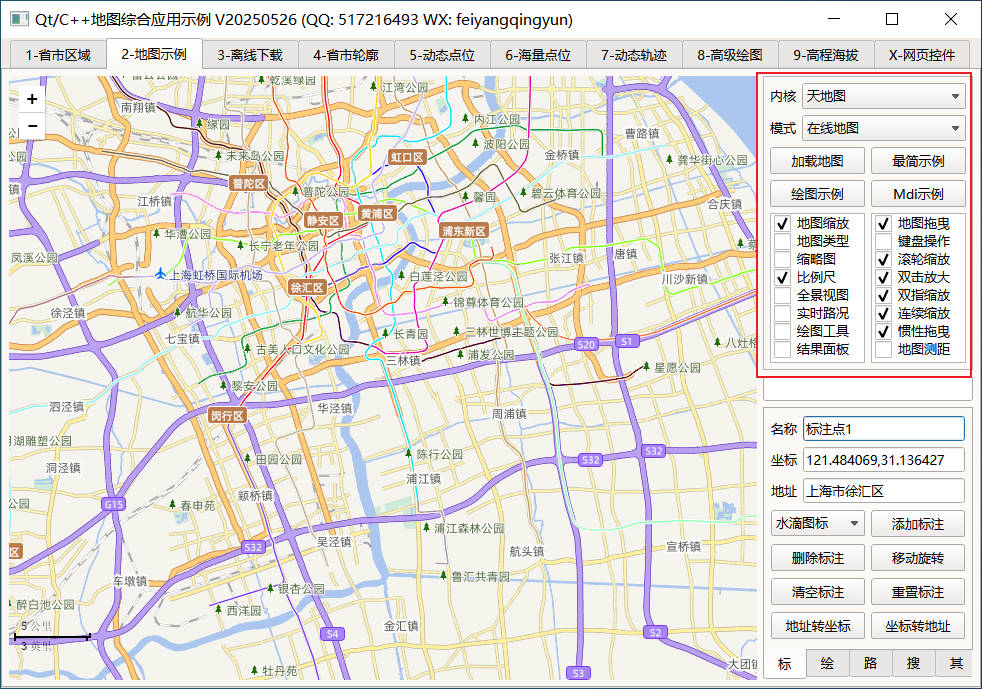

1. 右上角可以选择地图内核，默认是百度地图，还支持高德地图、天地图、腾讯地图等。
2. 地图模式可选在线地图和离线地图，离线地图不需要联网使用。
3. 下拉切换地图内核和地图模式，会自动重新加载当前内核和模式对应的地图，也可以单击加载地图按钮手动加载。
4. 单击最简示例按钮弹出地图示例的最简单使用示例，里面的代码非常简单。
5. 有两个列表复选框，左侧是启用地图控件功能列表，右侧是动态启用操作功能列表。
6. 左侧列表框勾选后，需要单击加载地图按钮重新加载，这些功能都是在加载的时候启用。
7. 右侧列表框勾选后，立即应用，通过执行对应的js函数触发的。比如勾选地图拖曳复选框，选中后，左侧的地图可以拖曳，不选中则不可以拖曳。切换复选框立即应用。
8. 选中地图测距复选框，左侧地图进入测距模式，可以直接在地图上选中多个位置进行测距。鼠标右键结束测距，测距结果会直接显示在信息框中，也可以在界面上直接看到每一段的距离。测距结束后，复选框自动取消选中。可以选中再次进行测距。

#### 4.2.1 最简示例
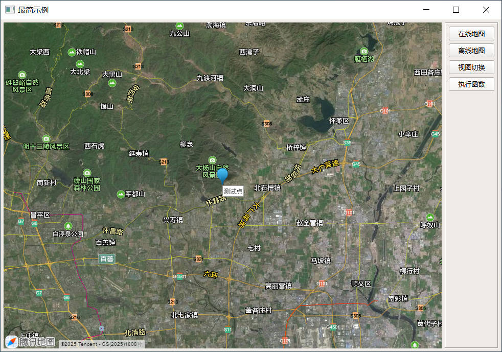

1. 由于整个地图模块的功能众多，有时候为了直接快速的上手使用，专门写了最简示例这个模块。
2. 单击在线地图和离线地图用于切换在线离线。
3. 单击视图切换按钮用于切换街道图、卫星图、混合图。
4. 单击执行函数用于演示如何执行js函数，比如设置地图级别、添加标注点等。

#### 4.2.2 绘图示例
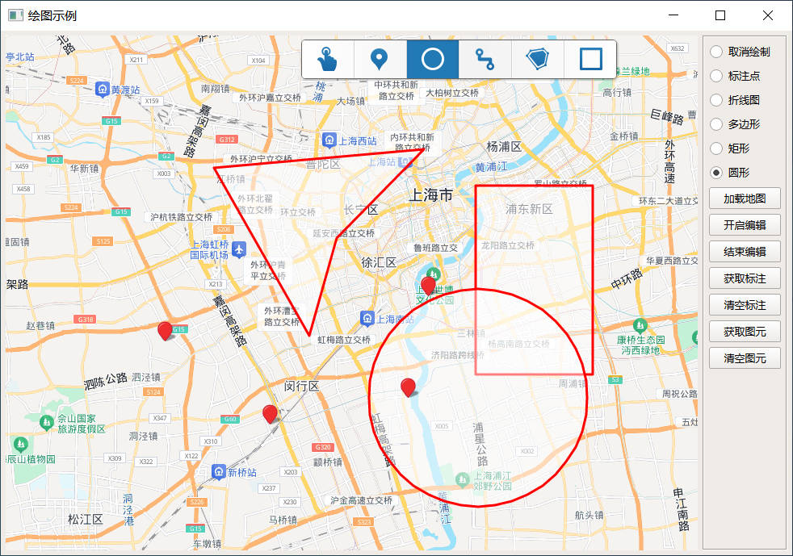

1. 本组件除了提供直接函数接口绘图，还提供了动态绘图，也就是开启了某一种绘图模式后，直接在界面上鼠标按下直接绘制。
1. 右上角选择要绘制的覆盖物类型，比如选中多边形，直接在左侧地图中鼠标按下绘制即可，一般是长按或者双击结束绘制。
1. 右上角选择取消绘制，则会结束绘制模式，此时可以拖动地图，不然在绘制模式下拖动地图他会以为你要添加覆盖物。
1. 单击开启编辑，会将当前地图中的所有覆盖物进入编辑状态，也就是可以拖动位置和调整大小。
1. 单击结束编辑，会将当前地图中的所有覆盖物结束编辑状态。
1. 单击获取图元，会将当前地图中的所有覆盖物信息打印弹出提示，用户可以拿到这些信息再进行处理。
1. 单击清空图元，清空地图中所有绘制的覆盖物。

#### 4.2.3 Mdi示例
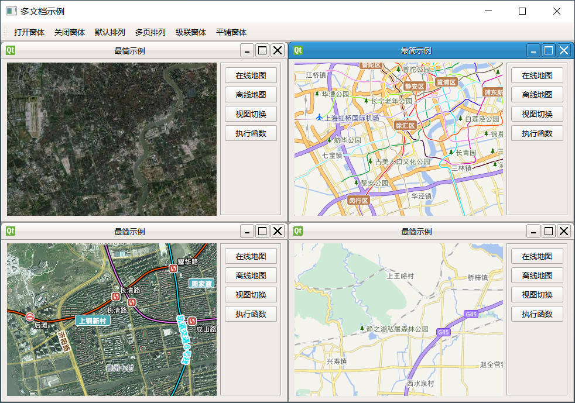

1. 演示多文档模式下打开多个地图，这里子地图窗体复用的最简示例。
1. 单击打开窗体，每次新生成一个地图窗体，可以用来测试支持打开N个地图窗体对应电脑CPU占用。
1. 可以切换默认排列、多页排列、级联窗体。平铺窗体看对应效果。

#### 4.2.4 地图标注
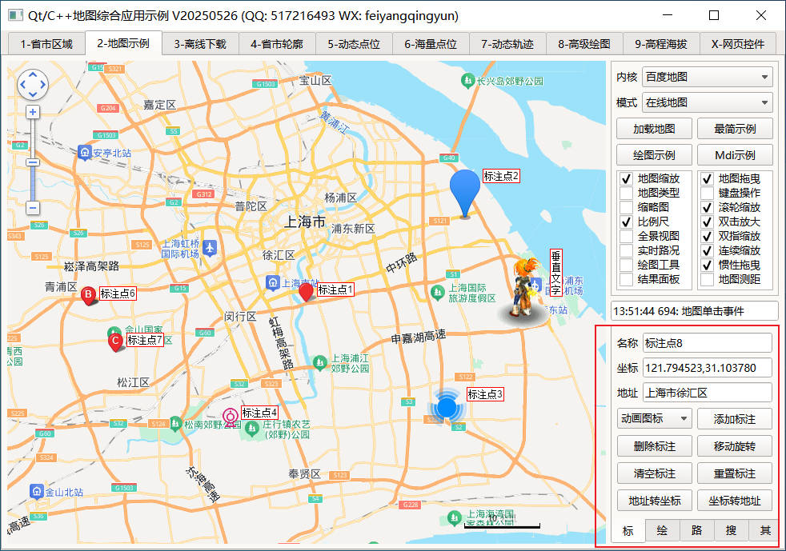

1. 从左侧地图上鼠标按下选点，对应经纬度坐标会填充到坐标文本框中。填写好对应的标注的名称，单击添加标注按钮，左侧地图中会出现一个标注点，鼠标单击对应的标准点，会弹出提示单击了哪个标注点。
2. 添加标注按钮的左侧是选择图片的类型，支持各种图片和尺寸，包括动图。默认图标文件在可执行文件下的mapimage目录。
- 默认图标：不指定图片文件，每种地图都有自己内置风格的标注图片。
- 水滴图标：指定一张水滴形状的图片，底部居中对齐。
- 圆形图标：指定一张宽高一样的圆形图片，居中对齐。
- 索引图标：指定一张大图，从中取固定位置的图标，网页中常见的方式。
- 动画图标：指定一张gif动图文件，底部居中对齐。
3. 在名称文本框中输入要删除的标注点名称，单击删除标注按钮，可以删除对应的标注点。后面改成了按照经纬度文本框中的经纬度坐标来删除标注点。两种方式都支持，可以代码中调整。
4. 在名称文本框中输入要删除的标注点名称，然后左侧地图中鼠标选点，单击移动旋转按钮，会自动将标注点移动到新的位置，并设置45度旋转。
5. 单击清空按钮会清空整个地图中的标注点。
6. 单击重置标注，将随机生成一些标注点以及位置，每次都是新的位置。
7. 在地址文本框中输入地址，单击地址转坐标，会查找到当前地址最近的经纬度坐标填入坐标文本框中。
8. 在坐标文本框中输入坐标，单击坐标转地址，会查找坐标文本框中经纬度坐标最近的地址填入地址文本框中。

#### 4.2.5 绘图功能
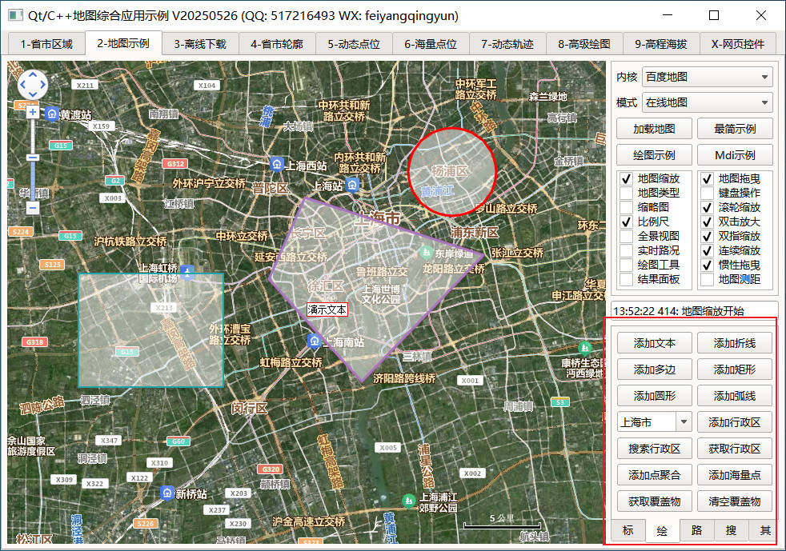

1. 本模块用来演示各种绘制功能，由于地图可能被拖动以及缩放，而本模块演示的都是固定的经纬度坐标，所以提供一个移动缩放按钮，用于切换到符合当前模块演示的地图坐标中心和缩放级别，方便查看绘图结果。
2. 单击添加折线按钮，会在地图中绘制一个折线图。后面的轨迹绘制等功能，其实就是用的绘制折线图功能。
3. 单击添加多边按钮，会在地图中绘制一个多边形，演示中复用的折线图坐标点集合，所以可以看到重叠了。多边形就是在折线图基础上增加了封闭区域，这个区域的背景颜色可以设置透明度。后面的行政区划功能，用的就是绘制多边形功能。
4. 单击添加矩形按钮，会在地图中绘制一个矩形，矩形区域只需要传入两个点坐标就行。
5. 单击添加圆形按钮，会在地图中绘制一个圆形，圆形区域需要传入中心点坐标和半径大小。
6. 单击添加弧线按钮，会在地图中添加一条弧线，这里演示也是复用的折线图的坐标，弧线的点可以开启拖曳编辑。
7. 上述绘制功能，基本上都提供了边框颜色、边框粗细、背景颜色等参数，具体参考示例源码。
8. 行政区下拉框中加载的一些已经保存的离线的行政区边界点坐标集合文件，默认从mapboundary目录加载，txt格式文件。
9. 行政区下拉选择后，会自动以多边形的方式绘制该区域的轮廓图。
10. 单击搜索行政区按钮，默认搜索上海市，搜索完成后，自动定位结果区域，并绘制轮廓图。此功能必须在线使用。
11. 搜索到对应行政区后，可单击获取行政区按钮，获取对应边界点经纬度坐标集合，结果显示在弹出的文本框中。
12. 单击添加点聚合按钮，可以添加点聚合，也就是密集区域的标注点会合并到一个大的标注，该标注会显示当前大标注点下有多少个小的点，单击该大标注，会自动切换到小标注的画面，这样就不会说密密麻麻的挤一块。
13. 单击添加海量点按钮，可以添加海量点，由于marker标注还是一个比较大的实例对象，所以当点好多万的时候，用marker的方式还是性能非常糟糕，这个时候就要考虑用海量点的方式，这种方式底层就是绘制形状的，性能非常高，而且也能识别单击了哪个点。
14. 单击获取覆盖物，会将当前地图中的标注点、折线图、多边形等对象的信息，发送出去，收到后，弹出框显示。用户可以拿到这个信息进行其他处理。
15. 单击清空覆盖物，会将所有的覆盖物对象删除。

#### 4.2.6 路径规划
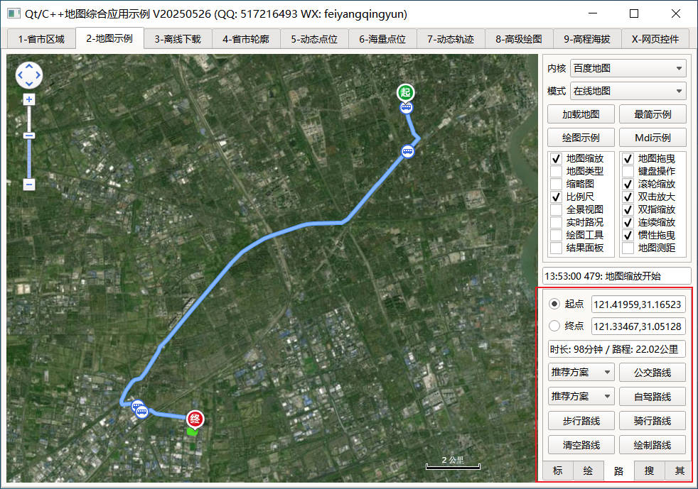

1. 路径规划也叫路线查询，可以查询公交路线、自驾路线、步行路线、骑行路线。本功能必须在线才能使用，因为路径规划方案都是存储在服务器上的。
2. 查询的前提是要选择好起点终点，单选框选中哪个，当前地图选点的结果就填在哪个文本框中。
3. 公交路线可以选择不同的策略比如推荐方案、最少时间、最少换乘、最少步行、不乘地铁等。
4. 自驾路线可以选择不同的策略比如优先高速、避开高速、避开拥堵。
5. 不同的地图内核对应有不同的策略方案，在下拉切换地图内核的时候会自动设置。
6. 单击对应的查询路线后，左侧会显示对应的结果，对应的时长和路程会信号发出来，并显示在信息框中。
7. 单击清空路线会将查询的结果清空。
8. 单击绘制路线会将当前查询的路线重新绘制，其实就是绘制的折线图。如果有多段路径则每段路径都不同颜色显示。
9. 一般的做法是通过在地图上选点，单击步行路线，然后拿到这个最优路径的坐标点集合，最后发给设备比如无人机或者机器人，让他按照这个轨迹导航运动。

#### 4.2.7 搜索信息
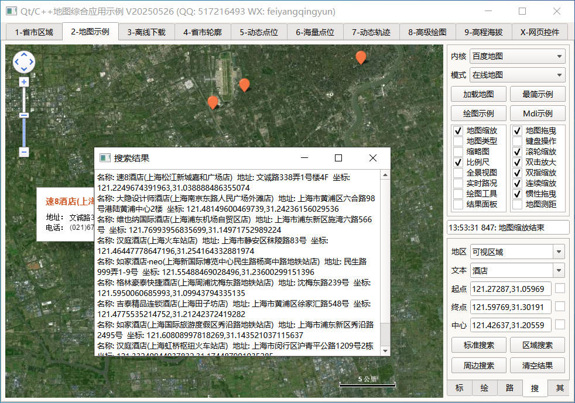

1. 搜索信息支持三种方式的搜索，单击对应按钮后，会弹出搜索结果，并自动以标注点形式添加到地图上。
2. 部分地图内核支持指定城市名称搜索，可以从地区下拉框中选择或者填入对应的城市名称比如北京市。
3. 文本框对应搜索的关键字，支持多个，可以手动输入。
4. 焦点切换到起点和终点以及中心点文本框，在左侧地图中鼠标选点，自动填入。如果两个文本框都没有焦点，则鼠标选点失效。
5. 起点和终点文本框是用于区域搜索，中心点文本框是用于周边搜索。
6. 单击标准搜索，自动以当前视野范围内或者指定的城市名称进行搜索。
7. 单击区域搜索，取起点作为左下角坐标，终点作为右上角坐标，形成矩形区域进行搜索。
8. 单击周边搜索，也就是圆形区域搜索，以中心点坐标，默认半径1000米以内，形成圆形区域进行搜索。

#### 4.2.8 其他功能
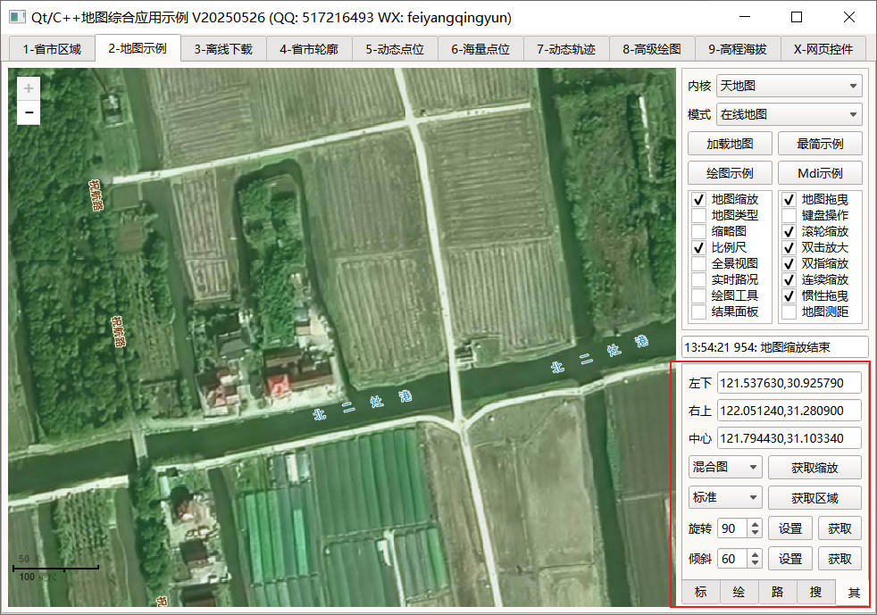

1. 单击获取缩放按钮，可以获取当前地图的缩放级别和中心点坐标。
2. 单击获取区域按钮，可以获取当前地图视图的区域的经纬度坐标，比如左下角的经纬度、右上角的经纬度、地图中心点的经纬度。
3. 下拉选择视图，比如街道图、卫星图、混合图，可以进行对应的视图切换。
4. 下拉选择样式，设置地图的样式风格。不同的地图内核有不同的样式风格。
5. 填写旋转角度值，单击设置可以对当前地图旋转，要对应地图以及浏览器支持。
6. 填写倾斜角度值，单击设置可以对当前地图倾斜，要对应地图以及浏览器支持。
7. 目前发现只有webengine浏览器内核支持，而且一般要gl版本的地图才有旋转和倾斜这两个功能。

### 4.3 离线下载
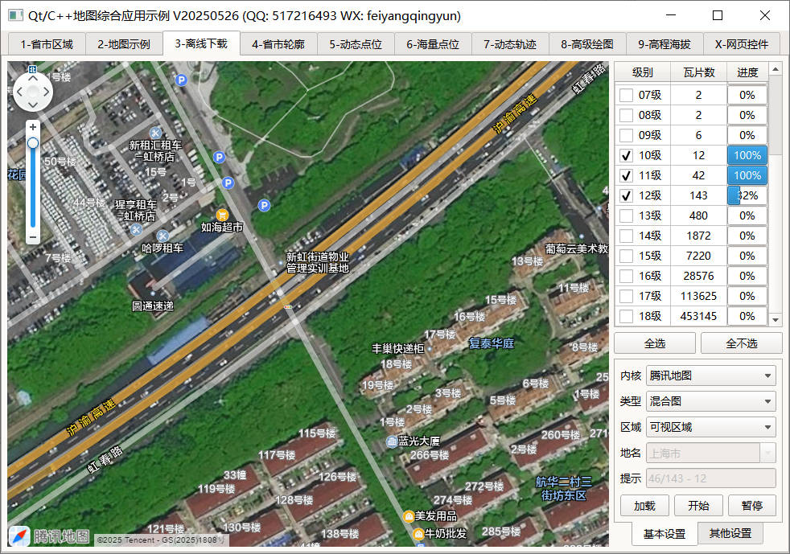
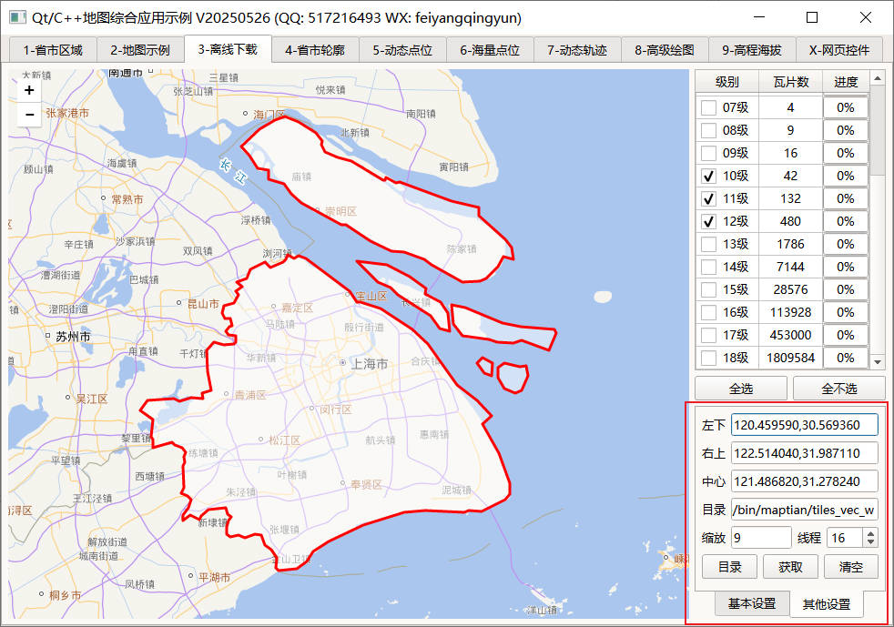

#### 4.3.1 区域地图
1. 第一步，选择地图内核比如百度地图。
2. 第二步，选择要下载的地图类型，比如街道图。
3. 第三步，区域选择行政区域，在地名中输入要下载的省市区域比如上海市、江西省等。**注意，这里既是下拉框也是输入框，下拉框只提供了常用的几个测试的地址，你也可以直接文本框中输入你想要的地址比如武汉市。这种控件叫可输入下拉框。**
4. 第四步，单击加载按钮，会将当前填的区域自动识别并切换到合适的视图范围，同时计算对应的地图级别对应的瓦片数量，显示在右上角的表格中。
5. 第五步，选中要下载的地图的级别，比如勾选12和13则只会下载该级别的离线地图。切记按需下载，不然地图文件数量过多，不知道下载到何年何月。
6. 第六步，单击开始按钮，会自动多线程下载瓦片地图，在提示栏中会显示当前下载哪个级别哪一张图片文件。
7. 单击暂停按钮可以暂停下载，开始按钮单击后会变成停止按钮，也可以单击停止按钮来结束当前的下载。 

#### 4.3.2 全国地图
1. 第一步，步骤和下载区域地图一致，唯一区别是，区域下拉框选择可视区域。
2. 第二步，左侧地图鼠标滚轮缩放到合适级别，以便显示整个中国地图的全貌。
3. 第三步，单击加载按钮，自动计算全国地图的级别瓦片数量。
4. 第四步，勾选要下载的级别。
5. 第五步，单击下载按钮。

#### 4.3.3 谷歌地图
1. 由于谷歌在线地图需要翻墙使用，而绝大部分用户电脑没有翻墙，需要离线使用谷歌地图。
2. 一开始没有瓦片地图文件的情况下，加载离线地图后是空白的页面，所以需要有个策略如何一步步下载需要的区域的地图。
3. 离线地图下载模块默认中心点是上海市，当前地图级别可以通过右下角的获取按钮查看。
4. 下面举例以下载中东国家沙特为例子，如何一步步下载沙特的离线地图。
5. 第一步，鼠标滚轮将地图级别缩放到3级，也就是最小的级别，此时一般都是能够显示整个地图。首次没有下载地图文件的情况下，地图区域应该是一片空白。
6. 第二步，右上角勾选3/4/5这几个级别，具体看有多少瓦片数量，一般到5级别的瓦片数量还是比较少的，如果不想等待太久，也可以就勾选3级别，单击开始按钮进行下载，下载后可以在左侧地图区域鼠标滚轮缩放，先到4级再到3级等，可以看到能够加载到部分地图，这个时候就能看清当前地区区域大概在哪里，这一步至关重要。
7. 第三步，左侧地图区域，拖动到中东沙特，滚轮缩放到5级别，调整合适的视图，直到整个沙特在整个区域的大致中间部分即可。单击左下角加载按钮，加载当前区域的瓦片地图下载信息到右侧的表格中，逐步勾选6/7/8级别，单击开始按钮慢慢下载。如果没有时间要求，也可以多勾选一些级别，就慢慢的等他下载就好。
8. 第四步，重复第三步的步骤，直到需要的区域全部下载完成。
9. 第五步，由于下载服务器可能有并发限制，不能保证所有瓦片地图一次性全部下载成功，尽管程序中有失败重新下载3次的机制，但是也有可能3次都下载失败，所以需要通过鼠标滚所缩放查看，哪个区域空白就表示该区域下载失败，重新下载该区域对应级别的瓦片就好。一般来说，网络正常以及服务器正常的情况下，都是能够完全正常下载成功的。

#### 4.3.4 特别提示
1. 街道图默认保存到tiles目录，卫星图保存到tiles_hybrid目录，路网图保存到tiles_self目录。可能这个目录描述不够准确，后期有可能会调整到更准确的命令，比如街道图 tiles_normal，卫星图 tiles_satellite，混合图 tiles_hybrid。
2. **天地图比较特殊，他是每一种都分底图和路网图，这样下来也就是有6种，地图类型下拉框是：街道图=矢量底图+矢量注记，卫星图=影像底图+影像注记，地形图=地形底图+地形注记。对应目录是：街道图底图是vec_w，街道图路网是cva_w，卫星图底图是img_w，卫星图路网是cia_w，地形图底图是ter_w，地形图路网是cta_w。**
3. 下载地图建议用多线程，以便最快速度下载，可以在其他设置界面中填入线程数量。
4. 选择行政区域和可视区域，唯一区别就是，行政区域当填入地名后单击加载按钮，会自动查找该区域所在地图位置，并切换显示。而可视区域是手动调整左侧地图的可视范围内的地图。
5. 如果提示瓦片数量过多，建议选择可视区域，然后左侧鼠标缩放到合适级别，让要下载的区域刚好填满整个屏幕，这样就不会下载多余的瓦片，往往这些多余的瓦片数量是不需要的。如果瓦片还是过多，建议再细分区域下载，比如一个省的可能太多，逐个按照市区来下载，一般是大级别的才会有很多瓦片。
6. 天地图每个秘钥每天的下载数量有限制。个人开发者限制在1W张，企业开发者限制在30W张，可以切换到账号后台 https://console.tianditu.gov.cn/api/traffic 查看具体限制。建议多申请几个秘钥，在MapDownHelper::initUrl()函数中加入多个秘钥，下载的时候会自动切换秘钥下载，这样可以下载的张数多一些。还有就是下载的时候尽量分区域下载，不然你都不知道下载到哪里失败了，以便下次继续下载。
7. 谷歌瓦片地图下载有可能需要翻墙才能使用。
8. 如果加载下载好的离线地图没有看到，只有一种可能，那就是当前级别当前范围的离线地图没有下载，你需要鼠标滚轮缩放和拖动到你下载的区域和级别才能看到，那问题来了，都没有图片也不知道拖到哪里了，所有就需要下载离线地图的时候，先下载大致的全国地图的轮廓，也不多，比如全国的下载到12级别，这样就可以拖动到对应的省份市区等。
9. 下载好的地图文件使用方法看本文档中的离线地图使用说明。

### 4.4 省市轮廓

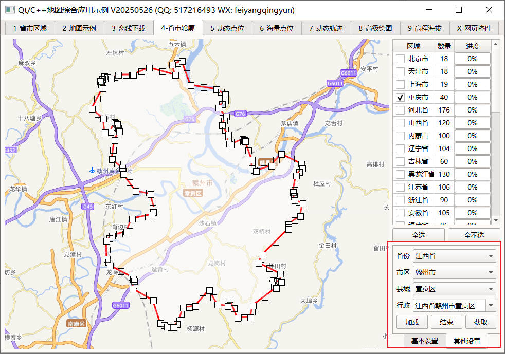

1. 为什么需要这个功能？比如一些变电站系统，每个变电站可以覆盖的范围都是固定的县或者乡镇，这样就需要开启编辑，然后获取到编辑后的点坐标集合，保存到文件，最后系统中加载这个文件，形成该区域的轮廓图。
2. 部分地图内核比如百度地图和高德地图等，才有行政区划的功能。
3. 右上角表格显示的全国的省市区域，可以勾选要下载哪些。
4. 可以设置下载的间隔，默认1s就行。
5. 保存文件的类型可以选择脚本文件（js拓展名）和文本文件（txt拓展名）。
6. 有三种方式可以收到返回的边界点集合，分别保存到不同的目录。
7. 方式一，从省市县城下拉框中选择后，单击加载按钮，会自动加载选择的行政区的边界图。这种保存到mapboundary目录下，文件名以行政区域命名。
8. 方式二，单击编辑按钮，按照行政区文本框中输入的区域，自动加载该行政区划的边界，并开启边界模式，可以在左侧地图中拖动边界点，完成后，单击获取按钮。此时返回的数据保存到mapboundary目录下，文件名以填入的那个文件名为准，相当于另存为。
9. 方式三，单击开始下载按钮后，自动定时器下载选中的省份的边界点数据，这种保存到mapboundary目录下，同时按照省份名称新建子目录，在子目录中保存。

### 4.5 动态点位


1. 本示例演示在地图上选点，添加主标注点和子标注点，其中主标注点有图标，每个标注点带速度值、时间等信息。
2. 第一步，左侧地图鼠标按下选点，坐标文本框显示对应的坐标，同时拆分经纬度值显示在对应文本框中。
3. 第二步，选择是否是标记点，填写速度和时间。
4. 第三步，单击添加标注按钮，将标注信息加入表格中。

### 4.6 海量点位

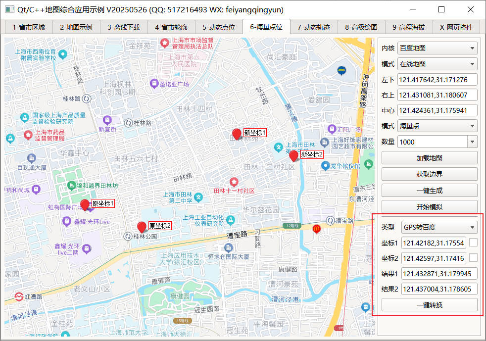

1. 本示例演示一键生成指定数量的标注点、点聚合、海量点，用于对比性能，比如在10000个数量下，明显海量点优于其他。项目中可以根据实际情况选择何种方式，点数量越多，性能排序依次是海量点、点聚合、标注点。但是海量点能够表示的信息比较少，就是一个绘制的图形，默认是圆形。
2. 本示例另一个主要功能是演示GPS坐标转换，由于政策原因，国内所有地图不能使用GPS坐标表示，理论上各个地图厂家提供的坐标系统都不是GPS的，要做转换。转换多少都有点误差，据说误差控制在5米。
3. 不同地图内核有不同的转换类型，比如百度地图本示例中支持GPS转百度、GPS转其他、百度转其他、其他转百度，四种方式的坐标转换。高德地图支持GPS转高德、图吧转高德、百度转高德三种方式。
4. 左侧地图鼠标按下选点后，单击一键转换，会显示对应结果，同时将两种结果以标注的形式显示在地图中，以便查看位置区别。一个是原来的位置，一个是计算后的位置。

### 4.7 动态轨迹
动态轨迹模块中包括两个部分，一个是直接界面选择起点终点规划路径，然后按照路径移动。一个是轨迹回放，生成轨迹点或者从轨迹点文件中读取轨迹点进行回放。

#### 4.7.1 动态轨迹
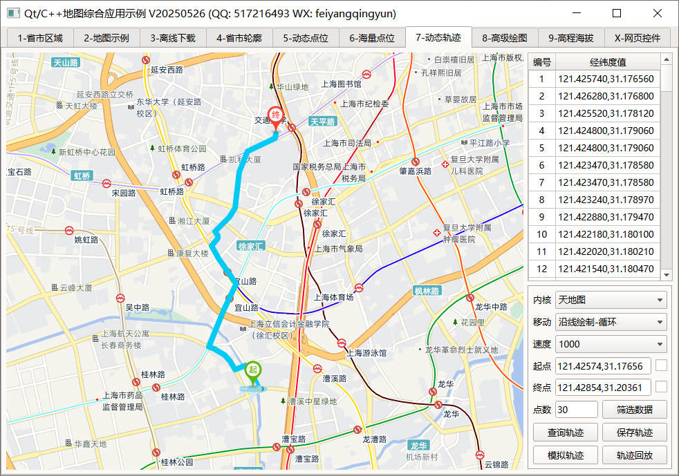

1. 第一步：选择地图内核，下拉地图内核可以动态切换地图内核。
2. 第二步：选择移动模式，支持多种移动模式，用来控制是否重新动态绘制当前轨迹进度以及是否循环移动。
- 重新绘制-单次：标注点移动到哪里，轨迹折线就绘制到哪里，只移动一次就结束。
- 重新绘制-循环：标注点移动到哪里，轨迹折线就绘制到哪里，移动完成后再次从起始点开始移动。
- 沿线运动-单次：标注点沿着路径点移动，只移动一次就结束。
- 沿线运动-循环：标注点沿着路径点移动，移动完成后再次从起始点开始移动。
- 沿线绘制-单次：标注点沿着路径点移动，同时以不同颜色绘制走过的路径，只移动一次就结束。
- 沿线绘制-循环：标注点沿着路径点移动，同时以不同颜色绘制走过的路径，移动完成后再次从起始点开始移动。
3. 第三步：选择移动速度，一般值越大速度越快。
4. 第四步：选择起始点和结束点坐标，需要在左侧地图中鼠标按下选点，起点和终点文本框后面有个复选框，哪个勾选了，则表示在当前地图中鼠标按下选中的经纬度坐标自动填入该文本框中。
5. 第五步：单击查询轨迹，查询结果路径中的经纬度坐标集合显示在右上角表格中。
6. 第六步：筛选数据，这一步可选，不筛选则以最原始的路径点数据进行。
- 筛选数据是根据设定的点数量，从原始数据中取平均值。数量表示最终筛选后的点数。
- 比如原始数据总数量是90个，点数填30，表示依次从90个数据中每3个点取一个，这样刚好是30个点。
- 为了保证数据完整性，第一个点和末位点一定在筛选数据中。也就是按照设定的点数取值后，可能会多出两个数据点。
- 为什么需要筛选？因为查询出来的轨迹点数量可能很多，比如几千几万个，如果每次移动一个点，这样速度很慢。
- 实际使用过程中还有一种情况是，无人机或者机器人，下发给他的经纬度坐标点数量有限制，这就也需要筛选数据。
- **筛选后如果想恢复数据，数量填0重新筛选即可，0表示不筛选直接用原始数据。**
7. 第七步：保存轨迹，这一步可选，可以将当前查询的轨迹点保存到文本文件中，以便提供给轨迹回放模块使用。
8. 第八步：模拟轨迹，单击模拟轨迹按钮，会按照设定的速度模拟轨迹点移动，按钮字样变成停止模拟，再次单击则停止模拟。
9. 第九步：轨迹回放，这一步可选，单击轨迹回放按钮，弹出轨迹回放界面。

#### 4.7.2 轨迹回放
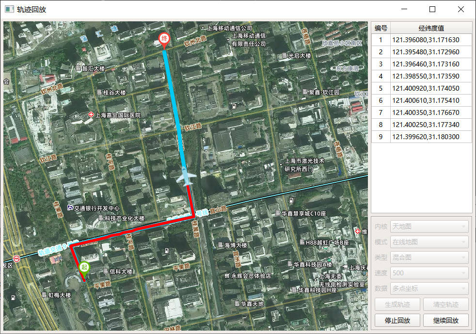

1. 下拉地图内核可以切换所使用的地图。
2. 也可以选择在线地图还是离线地图，目前百度地图有离线地图。
3. 切换地图类型，可以切换到街道图、卫星图、混合图三种。有些用户希望在混合图中看轨迹回放效果。
4. 选择移动的速度，值越大速度越快。
5. 下拉选择数据来源，可选两点坐标、多点坐标、文件导入。两点坐标用来测试给定两个点坐标，在两点个形成的直线上运动，主要是为了验证不是跳跃运动，而是匀速移动。底层会根据线条自动生成了平滑的移动点。
6. 文件导入就是导入的上一个界面保存轨迹后生成的文件，在这里可以看到回放。由于不同地图内核使用的坐标系不一样，所以这个文件的路径轨迹未必一致。比如百度地图搜索出来的轨迹点，放到其他地图上绘制，看起来经过的路线不正确，坐标点并不在实际的路线中。高德和腾讯的通用。
7. 在这里演示移动轨迹的时候，部分地图内核会自动设置当前地图中心点是最近的一个点，这样看起来效果更好。
8. 轨迹回放中的数据源下拉框选项有个文件导入，是从可执行文件根目录的points.txt文件导入的坐标，格式46.688610,24.773230;46.691320,24.773930，可以手动新建一个文件填入你需要验证的轨迹点集合，至少填两个点。这个文件在动态轨迹中查询路径后单击保存轨迹会保存到这个文件。

### 4.8 高级绘图
#### 4.8.1 各种示例


1. 为什么地图示例那边已经有通过函数接口绘制以及进入绘图模式绘制，这里还要来个高级绘制？
2. 这里着重演示如何更新覆盖物的参数比如多边形的坐标数据和圆形的半径等，也就是如何修改覆盖物信息。因为如果频繁的创建和删除覆盖物，很可能存在内存泄漏，很多时候只需要更新覆盖物信息即可，并不需要删除重新创建。
3. 根据具体的应用场景，单独提供了多个高级绘制的示例，比如雷达扫描和航迹模拟等，后续可能还会增加其他示例。
4. 图元也叫覆盖物，按钮上可能叫图元，其实就是覆盖物。
5. 类别下拉框，选择要添加的图元的类型，支持标注点、矩形、圆形等。
6. 标识文本框，填写要添加的图元的唯一标识，每添加一个后会自动+1，可以手动修改，当需要指定删除、修改、编辑的时候，需要手动填入唯一标识。
7. 添加图元，按照类别下拉框的类型，随机位置添加对应图元。
8. 删除图元，先要填写唯一标识，单击后会自动删除对应标识的覆盖物图元。如果标识不存在则不作处理。
9. 修改图元，先要填写唯一标识，单击后会自动修改图元的覆盖物属性，标注点演示的移动位置和修改图片，圆形演示的修改中心点和半径，其他覆盖物演示的修改路径点集合。
10. 清空图元，清空界面上添加的所有覆盖物。
11. 开启编辑，先要填写唯一标识，单击后会让对应覆盖物进入编辑模式，比如圆形会出现中心点和边缘手柄，拖动中心点手柄可以移动圆形到新的位置，拉动边缘手柄可以更改半径大小。标注点可以拖动到新的位置等。
12. 关闭编辑，先要填写唯一标识，单击后会让对应覆盖物结束编辑模式。
13. 开启监听，单击后对界面上的所有覆盖物添加鼠标按下事件，这里做了联动处理，在receiveDataFromJs识别到按下了哪个覆盖物，然后立即设置该覆盖物进入编辑模式，可以调整大小和拖动位置。
14. 关闭监听，结束对所有覆盖物的监听。
15. 显示所有，对界面上的所有覆盖物显示。
16. 隐藏所有，对界面上的所有覆盖物隐藏。
17. 折线箭头、直线箭头、斜线箭头、扇形区域几个是天地图独有的高级绘图接口。如果切换到其他地图内核，这里灰色不可用。
18. 添加扇形和删除扇形用来演示如何添加扇形以及指定唯一标识删除扇形。

#### 4.8.2 雷达扫描


1. 绘制三个固定的圆形对象，半径和颜色不一样。
2. 绘制一条直线，不断的做圆形路径移动。
3. 绘制一个扇形，不断的做圆形路径移动。
4. 绘制几个标注点对象，定义图标船形，不断的移动位置。
5. 右上角可以切换模拟的时间间隔，值越小速度越快。
6. 可以单击按钮来启动和停止模拟。
7. 支持缩放自动跟随，也就是地图变小这个图形也变小。
8. 可用来测试不断的变更覆盖物信息，会不会造成内存泄漏。

#### 4.8.3 航线模拟


1. 这里演示一个飞机沿着圆形的轨迹移动，方向角度跟着变化。
2. 可以切换顺时针还是逆时针旋转。
3. 可以切换每次移动的步长。

#### 4.8.4 航线规划
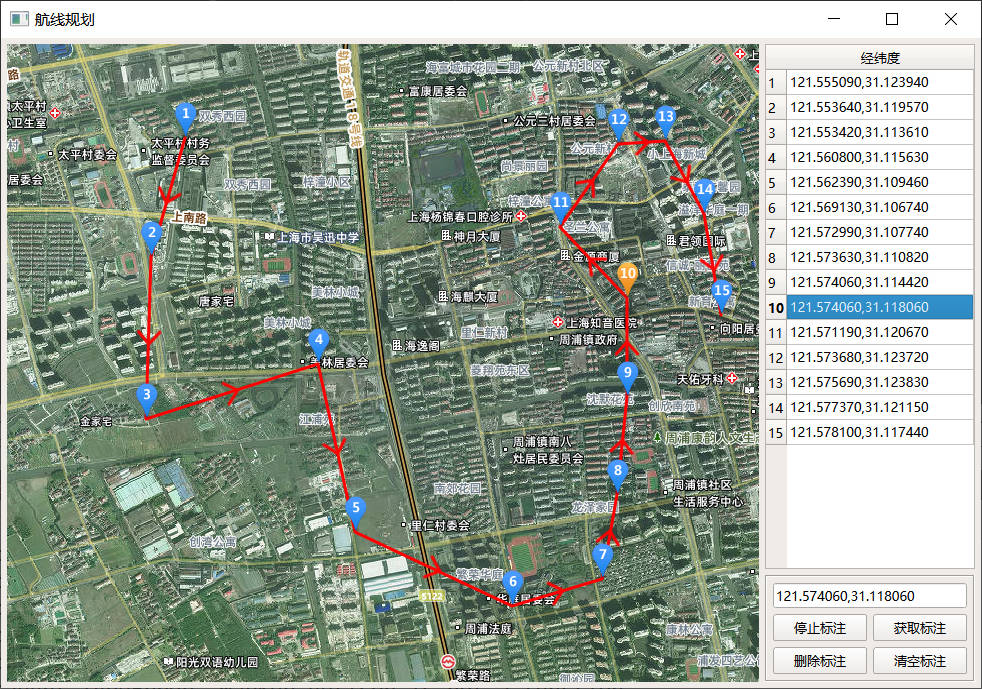

1. 自动加载和保存航线标注点。
2. 地图上单击标注点自动选择表格行。
3. 选中表格行对应标注点自动高亮。
4. 航线带方向箭头指示。
5. 支持删除指定标注点以及清空所有标注点。
6. 支持直接在地图上拖曳标注点移动位置。
7. 删除标准点后重新排序绘制航迹。
8. 标注点带序号图标显示，清晰直观。


### 4.9 高程海拔
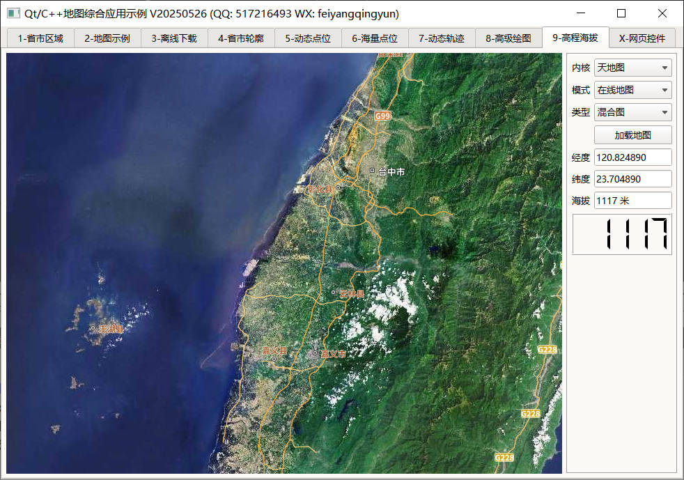

1. 本示例演示实时海拔高程数据。
2. 本地离线读取，传入的经纬度获取海拔高度值。
3. 地图比例尺1000米，可以去官网下载更详细的区域地图高程数据，比例尺精度更高。

### 4.x 网页控件
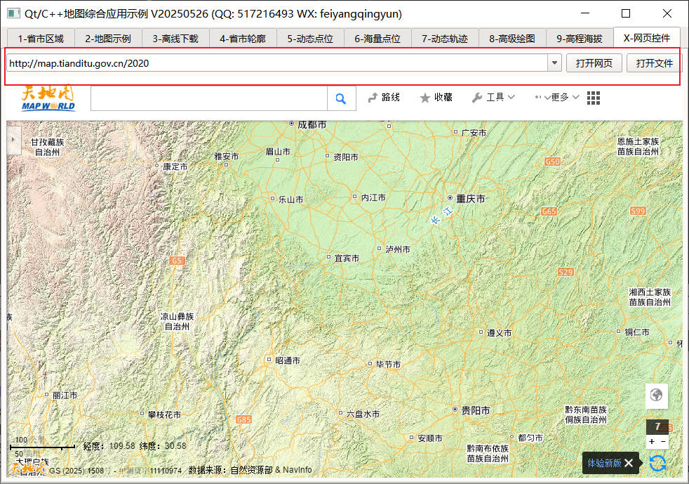

1. 本示例演示通用浏览器控件如何使用。
2. 单击打开网页，直接打开输入的网页地址。
3. 单击打开文件，选择本地网页文件加载。
4. 由于不同浏览器对js的支持程度、webgl的支持程度有限，所以可以在这里看到不同的效果，甚至有些网页未必在某些浏览器模块下能正常打开。

## 5、函数事件
### 5.1 函数说明
- 地图组件中封装了一些常用的函数，比如单击marker标注点弹出提示。
- 所以定义过的函数，在演示示例中都有对应用法。
- 目前发现如果使用webengine浏览器模块，天地图的dblclick双击事件有bug，会触发两次，官网的示例也是一样的bug。webkit和miniblink内核正常，应该属于天地图和浏览器底层兼容性问题。因为百度地图等其他地图在webengine下双击事件正常。

### 5.2 函数列表
- addMarkerEvent(flag, action, event, tips, width)，用于添加标注点事件/单击/双击/右键，flag表示标注点的唯一标识，action表示动作，0=不处理，1-内部弹窗，2-发信号通知。event表示事件类型，click-单击，dblclick-双击，rightclick-右键，tips用于内部处理弹出提示的内容，可以是html字符串。width表示内部弹窗最小宽度。
- 每次添加事件的时候内部会先移除同名的事件，可以添加多个事件，比如单击和右键同时存在。 

### 5.3 事件说明
- 地图组件通过各种事件通知来发送和传递数据，每个事件通知都带有唯一标识参数和具体数据内容参数，用户拿到唯一标识进行判断，再取出对应数据。
- 如果数据内容有多个内容，一般会以英文竖杠 | 隔开，可以转成字符串后再分割字符串挨个取出。
- 内容中的经纬度坐标，统一格式先经度再纬度，比如 121.424362,31.175942，因为有些地图比如谷歌地图默认是纬度经度，不统一的话不方便处理，所以整个组件中传入和传出的经纬度坐标都统一先经纬再纬度。
- 返回的参数标识全部小写。

### 5.4 事件代码
```cpp
//关联浏览器控件信号
webView = new WebView(this);
connect(webView, SIGNAL(receiveDataFromJs(QString, QVariant)), this, SLOT(receiveDataFromJs(QString, QVariant)));

void frmMapDemo::receiveDataFromJs(const QString &type, const QVariant &data)
{
    //下面演示的功能比较多/通过类型判断是什么数据回复的再进行处理
    //qDebug() << TIMEMS << "frmMapDemo" << type << data;
    QString result = data.toString();
    if (type == "rightclick") {
        QString pos = QString("[%1, %2]").arg(QCursor::pos().x()).arg(QCursor::pos().y());
        QString info = QString("触发鼠标右键\n当前经纬度值: %1\n当前鼠标坐标: %2").arg(result).arg(pos);
        QtHelper::showMessageBoxInfo(info);
    } else if (type == "dblclick") {
        QString info = QString("触发鼠标双击\n当前经纬度值: %1").arg(result);
        QtHelper::showMessageBoxInfo(info);
    } else if (type == "routepoints") {
        datas.clear();
        QStringList list = result.split("|");
        foreach (QString data, list) {
            datas << data.split(";");
        }
    }
}
```

### 5.5 事件列表
|事件|内容|说明|
|:------ |:------|:------|
|click|lnglat|鼠标单击事件，参数为对应经纬度坐标。|
|dblclick|lnglat|鼠标双击事件，参数为对应经纬度坐标，一般双击地图会放大地图。|
|rightclick|lnglat|鼠标右键事件，参数为对应经纬度坐标。|
|zoomstart||地图缩放开始。|
|zoomend||地图缩放结束。|
|zoom_changed||地图缩放改变。|
|bounds|lnglat1\|lnglat2\|lnglat3\|11|返回可视区域经纬度，坐标依次是左下角/右上角/中心点，末尾表示当前缩放级别。|
|center|lnglat|返回当前地图中心点坐标。|
|zoom|12|返回当前地图缩放级别。|
|rotate|45|返回当前地图旋转角度，部分地图内核才支持。|
|tilt|30|返回当前地图倾斜角度，部分地图内核才支持。|
|movestep|flag\|lnglat|轨迹点每移动一步触发一次，参数是唯一标识\|经纬度坐标。|
|moveend|flag|轨迹点移动结束触发一次，参数是唯一标识。|
|boundary|lnglat1;lnglat2\|lnglat1;lnglat2|行政区划轮廓图边界点坐标集合，其实就是多边形区域。一个行政区可能有多个不同的区域，比如某些岛屿，一个区域的经纬度坐标用英文分号 ; 隔开，多个区域用英文竖杠 \| 隔开。|
|newboundary|lnglat1;lnglat2\|lnglat1;lnglat2|同上，唯一区别就是boundary类型是通过执行searchBoundary函数返回的，newboundary类型是通过执行getBoundary函数返回的/也就是单击获取边界按钮触发的。|
|geocoderresult|flag\|lnglat/address|地址转坐标对应标识AddrToPoint，坐标转地址对应标识PointToAddr。|
|convertresult|lnglat1\|lnglat2\|lnglat3|坐标系转换，如果传入的是多个坐标，则返回多个坐标。|
|searchresult|title;address;lnglat\|title;address;lnglat|搜索关键字返回，参数依次是标题/地址/经纬度坐标，可能有多个，中间用英文竖杠 \| 隔开。|
|routeresult|duration\|distance|路径规划查询结果返回，时长和距离。|
|routepoints|lnglat1;lnglat2\|lnglat1;lnglat2|路径规划查询结果返回，路线的经纬度坐标集合，可能有多条路线，中间用英文竖杠 \| 隔开。|
|distance|88.8|地图测距过程中每一步触发一次，返回对应距离。|
|distanceend|188|地图测距完成触发，返回对应总距离，单位米。|
|overlayinfo|flag\|point/points等|调用getOverlayInfo函数触发，获取覆盖物信息，对应标识可以是marker/circle/polyline/polygon，如果是标注点则返回经纬度坐标，如果是多边形则返回坐标集合，圆形则依次是中心点/半径/边缘坐标集合。多个覆盖物则每个都会触发一次。|
|pointcollection|lnglat|单击点聚合中的某个点触发。|
|marker|flag\|event|鼠标单击双击右键标注点触发，event=click/dblclick/rightclick|
|polyline|flag\|event|鼠标单击双击右键折线条触发，event=click/dblclick/rightclick|
|polygon|flag\|event|鼠标单击双击右键多边形触发，event=click/dblclick/rightclick|
|rectangle|flag\|event|鼠标单击双击右键矩形触发，event=click/dblclick/rightclick|
|circle|flag\|event|鼠标单击双击右键圆形触发，event=click/dblclick/rightclick|
||||
||||

## 6、组件框架
- core_map是整个地图组件的完整源码，可以独立使用，拷贝过去集成到自己项目中即可。
- mapdown开头的类是用于瓦片地图下载，mapobjbase是所有地图的基类，由于通用代码较多，又拆分出来mapobjfun的类专门生成通用js函数，其他mapobj开头的都是具体地图的子类实现。其余类都是辅助类。
- 如果需要自定义一种地图内核，只需要继承自mapobjbase类，实现几个具体的基类函数即可，非常方便。
- 后面为了方便管理和拓展，将地图下载相关类放到了mapdown目录，地图基类放到了mapobjbase目录，地图子类放到了mapobj目录中，后期如果拓展新的地图内核，只需要新增个子类放到mapobj目录即可。

|文件|说明|
|:------ |:------|
|maphead|整个地图组件的公用头文件，这里定义了地图内核枚举值、启用功能类型枚举值、地图控件类型枚举值等。|
|maphelper|地图组件辅助类，这里放的一些常用的函数，比如加载地图内核到下拉框，根据不同内核获取网页基准目录，根据不同内核实例化地图类，文本经纬度与坐标互换等。|
|maputil|地图组件其他辅助类，主要放的一些坐标转换和计算的函数，比如获取两个经纬度的距离，根据经纬度和距离以及角度求目标经纬度，获取两点之间的角度，获取两个点之间的中间点，给定中心点经纬度和半径求左下角和右上角经纬度坐标，各种坐标系转化等。|
|mapdownhelper|瓦片地图下载辅助类，用于生成不同地图内核对应不同的瓦片地址。同时封装了下载图片文件函数。|
|mapdownload|瓦片地图下载类，里面负责实例化多个下载线程，可以单张下载和批量下载，可以启动和暂停以及停止下载服务。|
|mapdownthread|瓦片地图下载线程，传入经度纬度和缩放级别，自动获取到瓦片地址进行下载和保存图片文件到本地。|
|mapobjbase|所有地图实现的基类，通用的函数都在这里直接实现，不同的部分需要子类自己实现。每个地图子类都继承这个基类。这个类负责生成html代码，可以直接传给浏览器控件，也可以直接保存到文件，然后再浏览器控件加载这个网页文件。|
|mapobjfunbase|地图基类中拆分出来的一些基础通用函数放在这里，不然基类中的类文件太大不方便管理。这些通用函数整体框架类似，主要是不同的内核对应的一些对象名不一样，比如获取经纬度不同地图内核有不同的属性，lnglat latlng latLng等，严格区分大小写。|
|mapobjfunoverlay|地图基类中拆分出来的一些覆盖物相关通用函数放在这里，比如获取覆盖物通用属性（颜色、粗细、样式、透明度等），获取边界点数据集合，添加行政区划，添加监听事件，移除监听事件等。|
|mapobjbaidu|百度地图核心类，继承自mapobjbase。|
|mapobjbaidugl|百度地图GL版本核心类，继承自mapobjbase。|
|mapobjgaode|高德地图核心类，继承自mapobjbase。|
|mapobjtian|天地图核心类，继承自mapobjbase。|
|mapobjtengxun|腾讯地图核心类，继承自mapobjbase。|
|mapgoogle|谷歌地图核心类，继承自mapobjbase。|
|mapleaflet|leaflet地图核心类，继承自mapobjbase。|
|||

## 7、功能特点
### 7.1 地图功能
1. 支持多种地图内核，默认采用天地图，可选百度地图、高德地图、腾讯地图、谷歌地图、通用地图等。
2. 同时支持在线地图和离线地图两种模式，离线地图方便在不联网的场景中使用。
3. 支持各种地图控件的启用，比如地图导航、地图类型、缩略图、比例尺、全景导航、实时路况、绘图工具、结果面板等。
4. 支持多种地图功能的动态启用禁用，比如地图拖曳、键盘操作、滚轮缩放、双击放大、连续缩放、地图测距等。
5. 提供众多js函数接口用于交互，参数极其丰富，能够想到的应用场景需求都有实现。
6. 统一的信号槽机制，地图中的结果统一信号发送出去，收到后根据type类型区分。
7. 支持地图交互，比如鼠标按下获取对应位置的经纬度。单击标注点弹出对应点的信息。
8. 支持添加标注、删除标注、移动标注、清空标注，支持更新标注的图片、尺寸、位置、旋转角度等。
9. 标注点可以指定图标图片和尺寸，支持gif动图，支持指定以图片中心对齐还是底部中心对齐。可以设置旋转角度，带富文本提示信息。
10. 所有覆盖物比如多边形、矩形、圆形、标注点灯，都支持动态绑定单击、双击、拖曳开始、拖曳结束等事件，对应信号发出来，可以根据对应的信号处理逻辑，比如拖曳期间更新折线的坐标点集合。
11. 标注点事件支持单击发信号通知和自己弹框显示信息，弹框信息支持html富文本。
12. 提供地址转坐标和坐标转地址接口，同时支持在线和离线两种方式。
13. 支持各种图形绘制，包括标注点、折线图、多边形、矩形、圆形、弧线等。
14. 可显示悬浮的绘图工具栏，直接在地图上划线、标注点、矩形、圆形等。
15. 支持各种区域搜索，比如矩形区域、圆形区域，可以按照关键字匹配将搜索结果显示在地图中。
16. 可动态添加离线的行政区边界点数据。可以搜索行政区划并获取该区域的边界点数据。数据可以保存到文件以便离线使用。
17. 支持点聚合功能，多个小标注点合并到一个大标注点，防止点密集导致交互不友好。
18. 可以添加海量点，每个点都可以单击获取对应坐标和信息。
19. 所有的覆盖物信息比如标注点、矩形、多边形、折线图等，都可以主动获取对应的信息比如坐标点和路径等。
20. 支持路径规划，支持公交路线、自驾路线、步行路线、骑行路线，不同查询支持不同策略，可选最少时间、最少换乘、不走高架等。
21. 路径规划结果可以显示在地图中，也可以获取到路径点坐标集合。这个数据可以保存到文件，以便发给机器人或者无人机做导航用来轨迹移动。
22. 可以设置不同的地图视图比如街道图、卫星图、混合图。
23. 可以设置不同的样式，比如午夜蓝、青草绿等样式风格。
24. 可以设置地图的旋转角度和倾斜角度，一般需要地图厂家支持以及浏览器支持webgl特性。
25. 提供经纬度坐标纠偏转换功能，比如传入的GPS坐标需要转换到百度地图坐标或者高德地图坐标。各种坐标系转换全部离线函数，支持地球坐标系WGS-84、火星坐标系GCJ-02、百度坐标系BD-09之间的互相转换，涵盖了各种地图的坐标系。
26. 提供动态轨迹点移动功能，按照给定的经纬度坐标集合平滑移动，就算是两个点之间移动也会自动计算生成多个平滑的路径点来移动。
27. 所有函数接口都提供了非常详细的使用示例，满足各个水平区间的人员学习使用。
28. 组件同时支持qwidget和qml，支持编译到安卓系统运行，安卓上也支持离线运行。

### 7.2 其他功能
1. 地图示例中分别提供了标注点示例、覆盖物示例、路径规划示例、兴趣点搜索示例、其他示例等，非常详细。
2. 提供离线地图下载模块，可以选择不同的地图内核，比如百度地图或者谷歌地图，不同的地图类型，比如下载街道图还是卫星图，不同的地图层级，多线程批量极速下载。
3. 表格行实时显示对应的瓦片下载进度，有下载超时时间，重试次数，每个瓦片下载完成都发送信号通知，参数包括下载用时。
4. 提供省市轮廓图下载模块，自动下载各个地区的轮廓图，保存到脚本文件或者文本文件。
5. 支持手动调整不同区域的轮廓边界，调整后可以主动获取调整后的边界点集合。
6. 提供动态点位示例，手动在地图上选点并添加标注，附带自定义的信息比如速度和时间等。
7. 提供海量点位示例，批量添加标注点、点聚合、海量点。用于测试环境中支持的最大点位性能。
8. 提供动态轨迹示例，在地图上鼠标按下选择起点和终点后，查询路线，获取路径轨迹点，模拟轨迹平滑移动。可以筛选数据将过多的路径点筛选到设定的点数。
9. 提供轨迹回放示例，按照指定的轨迹点列表回放，也可以导入轨迹点数据进行回放。同时支持在街道图、卫星图、混合图中回放轨迹。
10. 提供高级绘图示例，可以动态添加、删除、修改、清空图元，可以对地图上的所有覆盖物开启编辑和关闭编辑，编辑阶段直接拖动位置和大小。可以对地图上的所有图元开启监听，监听拖动等事件，拿到对应信号进行处理。
11. 提供雷达扫描示例，演示在地图组件基础上进行二开，封装了雷达扫描类，扫描的同时有几个标注点移动。
12. 提供航线模拟示例，可以设置移动的间隔和每次移动的步长，可以设置顺时针还是逆时针旋转。一个飞机图标圆形旋转。
13. 提供航线规划示例，可以直接在地图上动态添加标注点，两个点之间直线相连，同时有箭头指示方向和角度，选中点高亮显示。
14. 提供高程海拔示例，演示传入经纬度获取对应点的高程海拔数据，无需联网离线使用，瞬间出结果。
15. 提供省市区域地图示例，采用echart组件，同时支持闪烁点图、迁徙图、区域地图、世界地图、仪表盘等。可以设置标题、提示信息、背景颜色、文字颜色、线条颜色、区域颜色等各种颜色。
16. 省市区域地图示例，内置世界地图、全国地图、省份地图、地区地图，可以精确到县，所有地图全部离线使用。可设置城市的名称、值、经纬度集合。
17. 内置通用浏览器组件，同时支持webkit/webengine/miniblink等内核。提供网页控件示例，演示打开网页和本地网页文件。
18. 支持任意Qt版本、任意系统、任意编译器，包括嵌入式linux和各种国产电脑环境。

## 8、特别说明
1. 受限于浏览器控件对web的支持程度，不同浏览器控件加载对应的地图网页，可能会出现部分特性不支持的情况，比如miniblink内核不支持地图设置旋转角度和倾斜角度，webkit内核不支持webgl的网页。个人推荐使用最新的Qt套件对应的msvc版本，一般会自带最新webengine内核，特性比较新。
2. 不同的地图内核有不同的优缺点，一般国内使用比较多的是百度地图、高德地图、天地图三种，谷歌由于需要翻墙才能使用，导致国内用户数很低。综合使用对比下来看，高德地图在api接口和文档示例方面最丰富的，应用场景也最全；百度地图在周边附近搜索方面最详细；天地图在地图精度和完整性方面最好。
3. 高德地图和谷歌地图，在国内都是采用国家标准的GCJ-02坐标系（也叫火星坐标系），这个标准是在全球标准WGS-84坐标系（也叫地球坐标系，GPS用）基础上加密的。天地图采用的是CGCS2000坐标系（也叫大地坐标系），和WGS-84坐标系（也叫地球坐标系）几乎无偏差，一般GPS设备和谷歌国际地图使用。 百度地图用的是BD-09坐标系，是在国家标准坐标系上又加密的。一般建议用国家标准的GCJ-02坐标系。如果对接的是WGS-84坐标，则建议用天地图。
4. **常规应用场景建议用高德地图，无人机相关场景以及测绘测量行业建议用天地图，对周边生活搜索要求高的场景建议用百度地图，海外地图场景建议用谷歌地图。天地图对浏览器的兼容性最好，而且地图切换流畅度最好。天地图的卫星图最全，精度最高。而且天地图坐标系可以和地球坐标系完美兼容，无偏差。**
5. 高德地图在不同版本之间的兼容性最好，绝大部分接口通用。百度地图对应的webgl版本主要就是将原来的对象BMap改成BMapGL。天地图是旧版本TMap改成T.Map。
6. 总体感觉天地图的API结构和命名方面是借鉴的百度地图的，腾讯地图借鉴的谷歌地图的，极大的雷同，这样也好，方便程序员。
7. 无论是百度地图还是高德地图或者天地图等，都多多少少存在bug，比如不少的情况是，通过new的时候构造函数传参数是可以的，而调用setxxx接口去设置确失败，可能对应接口还没测试好。所以在使用这些类的时候，尽量用构造函数传参数，就算不填实际性的内容，也要传个空数据，避免解析失败而导致后续的功能全无。
8. 百度地图gl版本的路书js文件中，生成了3个marker标注，完全重复多余，不知道是有人故意为之还是。后面发现是github的被人恶意改了，而官方地址 http://api.map.baidu.com/library/LuShu/gl/src/LuShu_min.js 是正确的。
9. 经过大量的模拟测试发现，对覆盖物的删除和清空clearoverlay等，高德地图和谷歌地图会在合适的时机释放内存，而其他地图几乎不会去主动释放，所以如果遇到需要很多覆盖物的场景，建议生成一次后，后面只是去改变该覆盖物的属性比如坐标位置和路径，而不是清空后再次去生成。这样就可以极力避免内存泄漏，这可能也是web的缺陷，没有手动释放机制，说是内部有垃圾自动回收，但是内部很可能判断失败，导致一直无法释放。
10. 腾讯地图的坐标是纬度经度，谷歌地图也是纬度经度，而百度地图、高德地图、天地图都是经度纬度，顺序有区别。
11. 瓦片地图的格式一般的规则是，街道图png、卫星图jpg、叠加层png。
12. 通过地图示例中的指定同一个经纬度坐标来添加标注，对照各种地图内核，可以看到，高德地图、腾讯地图、谷歌地图（中国区）这三个地图位置完全一致，因为都采用了国家标准的GCJ-02坐标系，而百度地图采用的加密的坐标系不一样，天地图采用的CGCS2000坐标系（和WGS-84坐标系几乎一致）。
13. 百度地图、腾讯地图没有提供绘制矩形覆盖物，可以通过绘制多边形覆盖物来实现。
14. 天地图的矩形区域，编辑状态下可以拖动位置，谷歌地图的所有覆盖物都支持拖动位置，其他地图内核目前没有看到如何支持拖动。
15. 天地图的符号标绘，有些是通过长按结束绘制，有些是通过双击结束绘制。

## 9、制作离线
### 9.1 天地图
1. 下载地图核心文件 http://api.tianditu.gov.cn/api?v=4.0&tk=您的密钥 ，核心文件必须下载。
2. 下载地图部件文件 http://api.tianditu.gov.cn/v4.0/components.js ，部件文件必须下载。
3. 下载地图样式文件 http://api.tianditu.gov.cn/v4.0/css/tianditu4.0.css 。地图样式文件必须下载。
4. 下载高级绘图文件 http://api.tianditu.gov.cn/v4.0/military.js 。非必须，一般用不上。
5. 下载服务请求文件 http://api.tianditu.gov.cn/v4.0/service.js 。非必须，用于发送网络请求获取逆地址解析、路径规划查询等，既然都离线了，也用不了。
6. 打开js文件和css文件，依次下载对应的图片，可以通过搜索 .png 查找对应的图片。
7. 打开核心js文件搜索 T.DomainFun()，将下面的路径改成本地的。
```cpp
E: "./",
e: "./image",
//E: T.Protocol.value + "api.tianditu." + T.Domain,
//e: T.Protocol.value + "api.tianditu." + T.Domain + "/v4.0/image",
```
8. 在路径这个位置下面是各种瓦片地址的在线地址，代码都是 return T.Protocol.value... ，这里可以不用改，直接在最终调用的地方更改更妥。
9. 最关键部分，将核心文件中的加载网络瓦片文件改成本地的，搜索 getTileUrl = function ，对应的函数就是返回的瓦片地址，里面总共定义了三种地图的瓦片，每一种地图都包含一个底图和一个叠加层。
```cpp
var i = new T.TileLayer("", {
    minZoom: 1,
    maxZoom: 18
});
i.getTileUrl = function(t) {
    return "tiles_vec_w/" + t.z + "/" + t.x + "/" + t.y + ".png"
    //return 0 == T.gq.EW ? T.w.t() + "TILECOL=" + t.x + "&TILEROW=" + t.y + "&TILEMATRIX=" + t.z : T.w.r() + "TILECOL=" + t.x + "&TILEROW=" + t.y + "&TILEMATRIX=" + t.z
};
var n = new T.TileLayer("", {
    minZoom: 1,
    maxZoom: 18
});
n.getTileUrl = function(t) {
    return "tiles_cva_w/" + t.z + "/" + t.x + "/" + t.y + ".png"
    //return 0 == T.gq.EW ? T.w.Y() + "TILECOL=" + t.x + "&TILEROW=" + t.y + "&TILEMATRIX=" + t.z : T.w.T() + "TILECOL=" + t.x + "&TILEROW=" + t.y + "&TILEMATRIX=" + t.z
},
TMAP_NORMAL_MAP = new T.MapType([i, n], "TMAP_NORMAL_MAP", {
    a: 1
});
var e = new T.TileLayer("", {
    minZoom: 1,
    maxZoom: 18
});
e.getTileUrl = function(t) {
    return "tiles_img_w/" + t.z + "/" + t.x + "/" + t.y + ".jpg"
    //return 0 == T.gq.EW ? T.w.I() + "TILECOL=" + t.x + "&TILEROW=" + t.y + "&TILEMATRIX=" + t.z : T.w.U() + "TILECOL=" + t.x + "&TILEROW=" + t.y + "&TILEMATRIX=" + t.z
};
var o = new T.TileLayer("", {
    minZoom: 1,
    maxZoom: 18
});
o.getTileUrl = function(t) {
    return "tiles_cia_w/" + t.z + "/" + t.x + "/" + t.y + ".png"
    //return 0 == T.gq.EW ? T.w.i() + "TILECOL=" + t.x + "&TILEROW=" + t.y + "&TILEMATRIX=" + t.z : T.w.u() + "TILECOL=" + t.x + "&TILEROW=" + t.y + "&TILEMATRIX=" + t.z
},
TMAP_SATELLITE_MAP = new T.MapType([e], "TMAP_SATELLITE_MAP"),
TMAP_HYBRID_MAP = new T.MapType([e, o], "TMAP_HYBRID_MAP");
var s = new T.TileLayer("", {
    minZoom: 1,
    maxZoom: 18
});
s.getTileUrl = function(t) {
    return "tiles_ter_w/" + t.z + "/" + t.x + "/" + t.y + ".jpg"
    //return 0 == T.gq.EW ? T.w.P() + "TILECOL=" + t.x + "&TILEROW=" + t.y + "&TILEMATRIX=" + t.z : T.w.O() + "TILECOL=" + t.x + "&TILEROW=" + t.y + "&TILEMATRIX=" + t.z
};
var r = new T.TileLayer("", {
    minZoom: 1,
    maxZoom: 18
});
r.getTileUrl = function(t) {
    return "tiles_cta_w/" + t.z + "/" + t.x + "/" + t.y + ".png"
    //return 0 == T.gq.EW ? T.w.p() + "TILECOL=" + t.x + "&TILEROW=" + t.y + "&TILEMATRIX=" + t.z : T.w.o() + "TILECOL=" + t.x + "&TILEROW=" + t.y + "&TILEMATRIX=" + t.z
},
TMAP_TERRAIN_MAP = new T.MapType([s], "TMAP_TERRAIN_MAP"),
TMAP_TERRAIN_HYBRID_MAP = new T.MapType([s, r], "TMAP_TERRAIN_HYBRID_MAP")
```
10. 核心文件拉到末尾，注释三行代码，这三行用来网络请求获取子js文件和css样式等。不注释可能导致其他的问题。
```cpp
//for (var n = 0; n < T.w.a.length; n++) T.lR.MR("TDT_style" + n, T.w.E + T.w.a[n]);
//for (var m = 0; m < T.w.A.length; m++) T.lR.nR("TDT_components" + m, T.w.E + T.w.A[m]);
//T.lR.bR(T.w.E + "/qv?tk=" + T.w.TMAP_AUTHKEY + "&t=" + Math.random() + "&callback=T.qv");
```
11. 代码中引入js和css文件。
```cpp
<script type="text/javascript" src="tianditu.js"></script>
<script type="text/javascript" src="components.js"></script>
<link rel="stylesheet" type="text/css" href="tianditu4.0.css"/>;
```
12. 天地图官方提供的瓦片每一种类型都分经纬度投影和球面墨卡托投影 http://lbs.tianditu.gov.cn/server/MapService.html ，我们平时一般用的是球面墨卡托投影，主流也是球面墨卡托投影。

## 10、版本说明

### V202503
1. 新增mapdraw目录，专门存放封装的各种绘制类，方便传入参数直接使用，比如雷达模拟，飞行轨迹，轨迹回放等。
2. 新增getOverlayInfo2函数，传入类型和覆盖物对象，获取对应的信息，比如经纬度坐标，圆形还有半径，矩形则四个点等信息，方便单击或者拖曳等地方获取，发出信号通知进行处理。
3. 新增统一的事件名转换函数，比如contextmenu纠正为rightclick，drag纠正为dragging，方便统一设置和接收处理。
4. 精益求精，大幅度降低高程海拔数据占用的内存，从1.5G占用降低到0.15G，核心就是将之前的字符串存储的值改成qint16数据类型。

### V202502
1. 新增地图事件参数，默认地图会添加单击事件，如果还要添加其他事件，需要调用setMapEvent函数设置，参数是对应枚举值，支持多个组合，比如mapObj->setMapEvent(MapEvent_Click | MapEvent_RightClick)表示同时添加地图单击和右键事件。
2. 新增了地图鼠标移动事件，方便实时获取高程海拔值。
3. 新增高程海拔示例，可以直接在地图中移动，实时显示对应的高程海拔值。

### V202412
1. 将标注点单击函数重写，改成支持单击双击右键多种事件，可以同时添加多个时间，有一些应用场景需要单击执行一个动作，双击执行其他动作。
2. 在所有覆盖物的单击事件监听基础上，增加了双击和右键的事件。
3. 所有覆盖物单击双击右键事件通知信号参数增加事件类型，之前只有一种单击，现在新增了双击和右键，需要区分。click、dblclick、rightclick。
4. 统一将右键传入传出参数改成了rightclick，遇到天地图，如果传入了rightclick，函数内部会自动转成contextmenu事件，传出自动转成rightclick事件，这样方便外部统一处理。

### V202410
1. 地图类型下拉框动态加载，普通地图有街道图、卫星图、混合图，天地图有6种，多了地形图和地形混合图。
2. 天地图删除覆盖物函数增加删除测距留下的覆盖物，参数标识定义为 distancetool。
3. 天地图添加高级覆盖物函数addCover增加唯一标识参数，方便删除。
4. 天地图删除覆盖物函数deleteOverlay增加唯一标识参数，用于指定标识删除覆盖物。
5. 绘图示例增加添加扇形和删除扇形示例。

### V202409
1. 新增开启编辑和停止编辑函数，用于对地图上的所有覆盖物编辑，比如标注点可以拖动位置，多边形拖拉控制点，圆形调整半径等。
2. 地图示例新增多文档示例，用于演示在mdi窗体中加载多个地图示例。
3. 地图示例新增绘图示例，用于演示如何在地图上动态添加标注点、折线、多边形、矩形、圆形覆盖物，可以开启和结束编辑，获取覆盖物信息。
4. 统一获取覆盖物信息对应矩形区域四个点坐标依次为左上/右上/右下/左下。
5. 绘图工具栏增加对应函数切换到哪一种图形绘制，比如主动设置切换到矩形框绘制。
6. 高德地图增加对覆盖物的开启编辑和停止编辑处理，包括行政区划的编辑状态切换，高德地图和其他地图比较特殊，用的是单独的编辑对象来实现编辑。
7. 废了巨大精力研究，离线地图增加天地图的支持，可以加载6种瓦片文件。
8. 离线地图下载类型增加函数判断不同地图内核有不同的瓦片文件类型。
9. 谷歌地图下载增加中文英文两个版本选择，从下拉框选择即可，现在分街道图-中文、混合图-中文、街道图-英文、混合图-英文、卫星图共5种。越来越多的用户需要在非中国区使用。
10. 地图示例中的绘图示例，增加天地图的符号标绘演示，比如绘制折线箭头、直线箭头、扇形区域等。
11. 增加了添加自定义图层函数，可以通过指定XYZ地址叠加图层。
12. 天地图行政区划增加对飞地的判断，飞地按照新的区域绘制。

### V202408
1. 增加默认地图类型参数，比如默认加载后就是卫星图。
2. 重写轨迹回放相关函数，采用路书策略，而不是之前的跳跃移动，现在是平滑移动，哪怕路径是两个经纬度坐标点，也会自动生成一堆坐标点路径，平滑移动。
3. 路书增加伴随线条，移动轨迹到哪里就绘制到哪里。
4. 地址和坐标互转，增加唯一标识，方便多个转换给定标识取结果。
5. 修复天地图鼠标右键识别错误的bug。
6. 添加折线增加参数arrow，表示是否开启方向箭头，对应参数值是颜色值，默认为空则没有箭头。
7. 测试发现天地图中写死了路径，导致设置了baseurl后，不能正常加载瓦片文件，所以在地图基类中专门增加了处理，以便兼容天地图。
8. 新增单个折线添加数据点函数。
9. 新增地图控件配置参数。
10. 百度地图默认地图可点弹出信息改成默认关闭，比如单击一些火车站会弹出一个大面板。
11. 解决百度地图gl版本添加折线自身缺陷的bug，在添加折线的时候必须指定一个坐标点，但是在后续添加折线数据的时候，该点需要移除。
12. 完善了各种坐标系的转换离线函数，比如新增了火星坐标系转地球坐标系、百度坐标系转地球坐标系等，现在满足了三种坐标之间的互相转换，共六种情况。
13. 天地图模块增加删除CarTrack对象，官方提供的clear方法无效，查看源码得知，要用 \_Remove方法。
14. 海量点测试增加了圆形覆盖物的类型。
15. 去掉浏览器模块中的IE浏览器的支持，这个太古老了。
16. 将所有地图内核的全局对象的初始化移动到函数中处理，在需要的时候先调用 initxxx 函数初始化。
17. 修复在Qt6中跨域请求的问题，腾讯地图的路径规划等接口都是通过网络请求去获取，涉及到跨域的问题。
18. 更新新的谷歌离线地图下载地址，无需翻墙。
19. 瓦片下载地址全部换成字符串更新替换格式，更精准。
20. 瓦片地图下载的文件拓展名由请求后获取到的真实的格式决定，之前是固定的jpg，不准确，很多时候是png。
21. 修改百度地图离线js文件，增加每种图层的拓展名定义，因为可能拓展名不一样，现在是按照实际的图片拓展名来保存文件。
22. 修复地图示例中地图模式下拉框更改后不会保存配置文件的bug，修复地图示例中地图缩放复选框勾选写死的bug。
23. 地图下载模块增加地图级别的处理，不同地图模块支持的地图级别范围不一样，谷歌地图可以到20级，百度大城市到19级其他区域到18级，其他地图基本上都是到18级别。自动根据不同地图内核隐藏不需要的级别。
24. 离线地图下载新增腾讯地图下载，支持街道图、卫星图、路网图。瓦片地址找了很久，计算规则和其他的地图不一样。
25. 谷歌离线地图下载支持中英双语参数设置，比如下载俄罗斯地区默认是中文加俄语，也可以设置成英文加俄语。
26. 修复天地图获取多边形区域getLngLats后数多维数组的bug，要取出第一个后再遍历。
27. 将谷歌离线地图中的网络请求相关的全部删除，已经全部离线使用了，不需要去请求。

### V202407
1. 新增公共函数类，全部静态方法，将多种地图通用的方法放其中，比如获取边界点数据集合getBoundary函数，所有地图内核写法都一样。那为什么不放在base基类中？因为base基类已经有不少的函数，所有公共的通用的处理函数，全部放单独的静态类文件，方便通用管理。
2. 修改浏览器内核代码，增加设置cookie目录，避免有时候默认目录没有权限导致加载失败。
3. 逐步增加了对高德地图、天地图的支持。
4. 剥离echart类，单独一个组件，方便后期拓展其他图表示例。地图就单独的map组件。
5. 统一目录，之前全部挤在config目录下很乱，现在拆分成echarts目录，mapbaidu目录专门存放离线的百度地图相关文件，mapboundary目录存放行政区域边界点文件，mapimage目录存放地图相关图片文件，cookie目录存放浏览器控件的缓存文件和webengine浏览器控件交互用的qwebchannel.js文件。
6. 新增了搜索示例，有常规关键字搜索，多边形区域搜索，周边搜索等，支持多个关键字。搜索结果以信号通知返回。
7. 搞定百度地图公交路径规划返回加过只有步行路径的bug，原来公交路线要用其他函数去获取对应的路径。
8. 重写标注点相关函数，生成的标准点对象用数组存起来，后期只需要从这个数组中遍历进行修改即可，而不需要去地图中获取，比如获取后移动位置以及设置旋转角度。
9. 新增标注点单击事件处理函数，可以动态更改单击弹出的信息以及是自己弹窗还是交给qt这边弹窗处理。
10. 简化设置是否保存文件以及保存的网页文件名称，自动根据内核设置对应的基准目录。
11. 坐标字符串转坐标数组函数getPoints增加对参数的判断，如果已经是数组则直接返回不用转换。这样大量采用此函数绘制图形的地方也支持直接传入数组。
12. 新增qml示例，采用qml中的webview组件加载，为了统一移动平台，简化交互机制，采用websocket通信接收应答数据。
13. 增加loadSuccess信号，只有加载成功才发送，而且是短时间内加载后最后一次信号，避免了频繁的信号。
14. 新增清空所有覆盖物函数clearOverlay，在清空覆盖物的同时，把一些临时对象数组也清空，比如标准对象数组。
15. 修复百度地图路径规划枚举值定义不准确的bug，比如优先高速BMAP_DRIVING_POLICY_FIRST_HIGHWAYS对应值是4，而在文档中对应顺序是1，再比如最少换乘BMAP_TRANSIT_POLICY_LEAST_TRANSFER对应值是1，而在文档中对应顺序是2。现在全部改成采用真实值而不是下拉框的索引。
16. 将qwebchannel.js文件放到webview组件的资源文件中，省的拷贝，保证编译直接就能运行。同时验证了webkit内核和webengine内核都支持资源文件的图标文件，对应写法前缀qrc:/fly.png。
17. 添加标注函数增加center参数，表示当前标注图标是在中心点还是底部居中，很多气泡箭头的图标都要以底部居中更好看，一般地图内核默认是中间居中。

### V202406
1. 重写整个地图内核组件，改成了基类子类的模式，为后面拓展其他地图内核做准备。
2. 统一函数接口，比如添加标注、添加折线图等功能，全部换成js异步加载，而不是写在网页内容中。
3. 新增了多个js函数接口，比如加载离线文件中的行政区划地图点集合。
4. 重写整个地图示例，更加精细化模块化，非常易于阅读学习。
5. 修复动态轨迹点内存泄漏的bug，改成了复用折线图对象，通过更新点集合数据来实现。
6. 地图下载增加线程数量设置。
7. 新增了地图测距功能，支持在线离线。
8. 将之前的简易示例合并到地图示例中，通过右上角按钮最简示例打开。
9. 将之前的轨迹回放示例合并到动态估计示例中，通过右下角按钮轨迹回放打开。
10. 路线查询后的轨迹点支持保存到文件，同时在轨迹回放模块中加载。
11. 

### V202401
1. 2021-12-03 统一定义多个区域坐标点集合规则 121.42721122307,31.17876546443;121.42719595187,31.178763147276|121.42721122307,31.17876546443;121.42719595187,31.178763147276，彻底解决不同浏览器内核之间坐标数组不兼容的烦恼。
2. 2022-03-20 离线地图下载模块增加自动下载失败的图片，防止一次下载失败就跳过导致没有下载成功的缺陷。将下载成功率从95%提高到100%。
3. 2022-04-24 修复离线地图不支持混合图的问题，需要先在离线地图下载器下载好路网图，放到tiles_self目录即可。
4. 离线地图下载中的网络图相当于路况图的大图，可以根据需要选择路况图还是网络图。